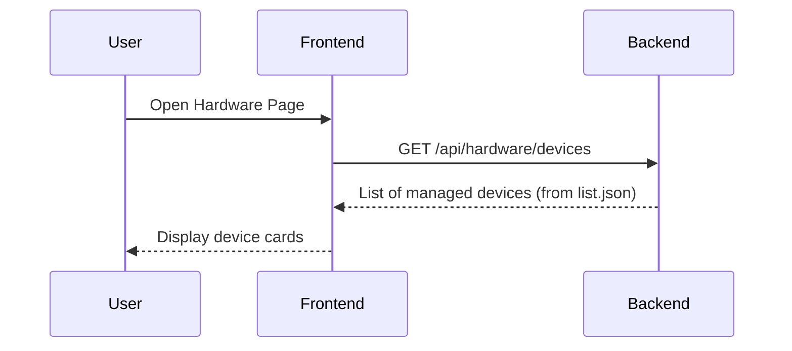
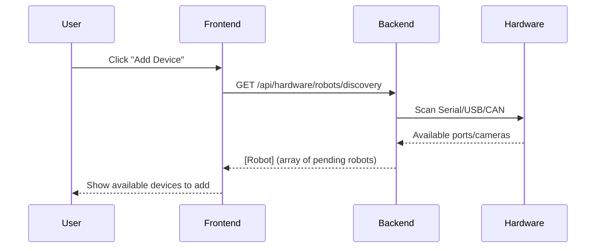
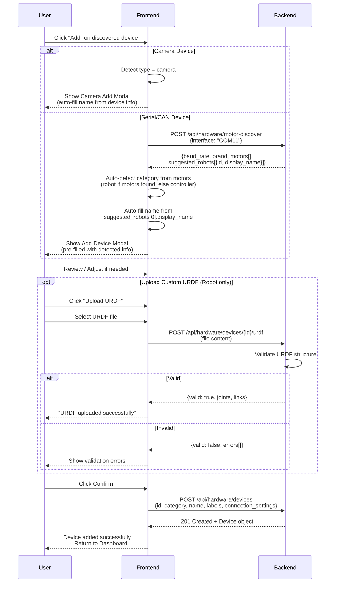
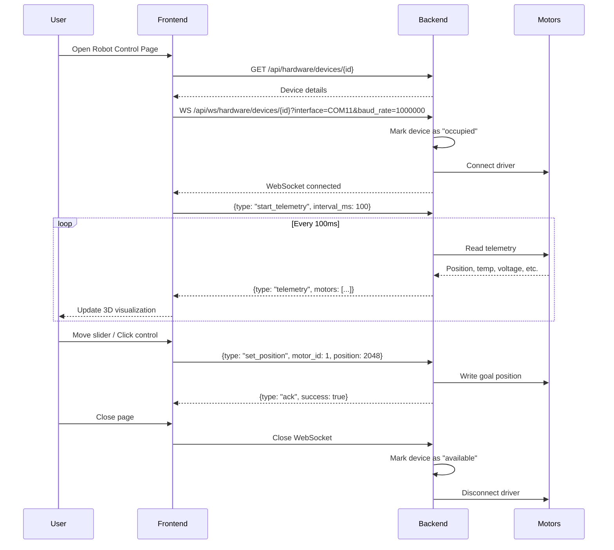
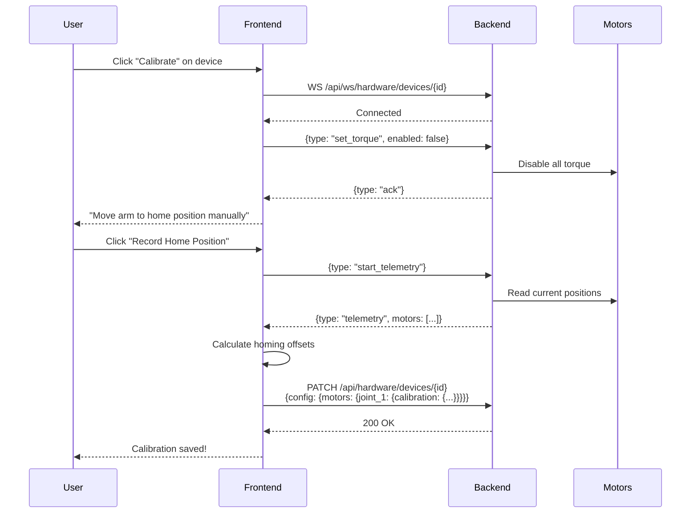
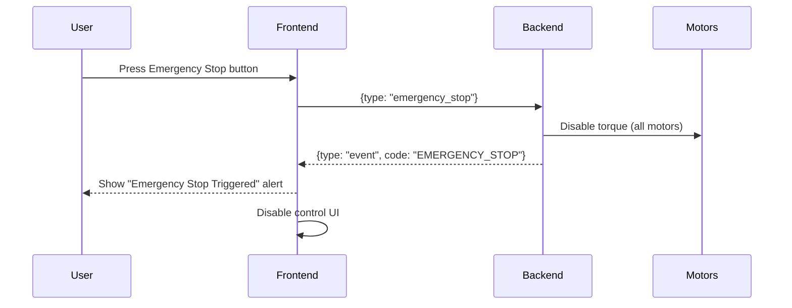
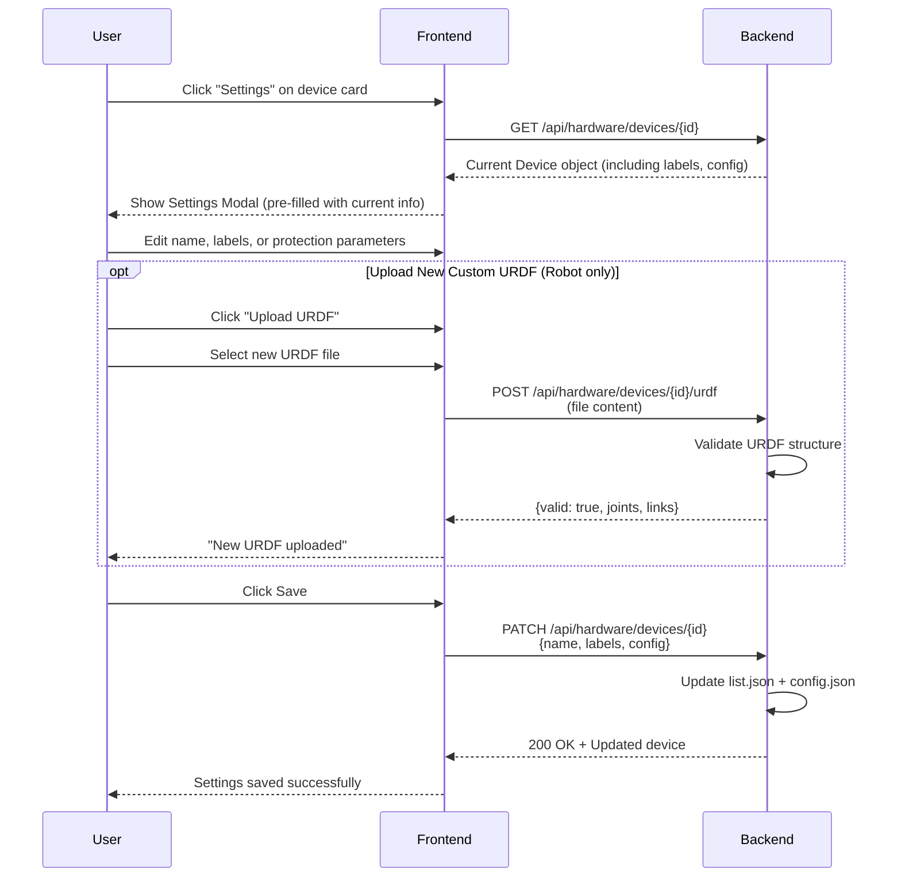

# Hardware Management Specification

## 1. Overview
This feature aims to provide a unified interface for managing hardware devices connected to the system, specifically robotic arms and controllers. Camera capture and streaming are supported via dedicated APIs, but cameras are **not** managed in the same way as robots and controllers (see note below). It allows users to identify, label, configure, and control supported devices.

## 2. Functional Requirements

### 2.1 Device Identification & Management

**Supported Device Categories**:
- `robot`: Execution devices (follower arms) - require torque control and protection parameters
- `controller`: Input devices (leader arms, gamepads, SpaceMouse) - used for teleoperation

Note: Cameras (RGB/depth) are **not** managed as hardware devices in this feature. Camera functionality (snapshot, streaming) is provided via dedicated capture APIs; the hardware management lifecycle (discovery, add/remove, labels, calibration) applies only to `robot` and `controller` categories.

- **Scan & List**: Automatically detect connected USB/Serial devices.
- **Unique Identification**: **Strict Requirement**. Devices *must* have a readable unique serial number to be supported.
    - **No Fallback**: Devices without a unique serial number (common in cheap USB devices) **cannot be added** to the system.
    - **API Behavior**: The backend `POST /api/hardware/devices` **rejects** requests with empty or missing `id` (HTTP 409). Attempts to add devices with `category` set to `camera` are **rejected** because cameras are handled as stateless capture/preview resources.
    - **UI Behavior**: Such devices will appear in the discovery list as "Unsupported (No Serial Number)" with the "Add" button disabled and a tooltip explaining the limitation.
- **Device Naming**: Allow users to assign a human-readable "friendly name" to any device (e.g., "Left Arm", "Overhead Camera"). The default value is the device's product name from hardware metadata (e.g., "HP 320 FHD Webcam", "Koch v1.1").
- **Tagging & Labels**: Adopt a **Key-Value Label** system (inspired by Kubernetes) for flexible management.
    - **Format**: `key: value` (e.g., `role: leader`, `position: left`).
    - **Label Selectors**: The system can query devices using selectors.
    - **Use Case Example**: "Start Recording" workflow automatically finds the device where `role=leader` to record controls from, and `role=follower` to send commands to.
- **Persistence**: Save metadata (name, labels, calibration) to local storage so it persists across reboots.

### 2.2 Label Strategy (Standard Labels)
Start with a set of recommended/standard labels to unify automation:
- `leropilot.ai/role`: `leader` (teleop master), `follower` (teleop puppet), `standalone`.
- `leropilot.ai/position`: `left`, `right`, `center`.
- `leropilot.ai/type`: For controllers: `robot_arm`, `gamepad`, `spacemouse`.
- *Users can still add custom labels (e.g., `project: assembly-line-1`).*

**Category and Label Examples**:
```json
// Follower robot arm
{
  "category": "robot",
  "labels": {
    "leropilot.ai/role": "follower",
    "leropilot.ai/position": "left"
  }
}

// Leader robot arm (controller)
{
  "category": "controller",
  "labels": {
    "leropilot.ai/type": "robot_arm",
    "leropilot.ai/role": "leader",
    "leropilot.ai/position": "right"
  }
}

// Gamepad controller
{
  "category": "controller",
  "labels": {
    "leropilot.ai/type": "gamepad"
  }
}
```

### 2.3 Robots
- **Status Display**: Show connection status, current joint angles/coordinates.
- **Motor Discovery & Monitoring**:
    - **Auto-Scan**: Scan motor bus to discover all connected motors (ID, Model, Firmware).
    - **Live Telemetry**: Real-time display of motor status:
        - Position (raw encoder + degrees)
        - Velocity
        - Current/Torque
        - Temperature (°C) with warning thresholds
        - Voltage (V) with warning thresholds
    - **Health Alerts**:
        - ⚠️ Warning: Temperature > 50°C or Voltage < 11V
        - 🛑 Critical: Temperature > 60°C or Voltage < 10V — the backend will **auto-disable torque** for affected motors and **emit an `EMERGENCY_PROTECTION` event** over the WebSocket to notify clients.

            Example event payload:

            ```json
            {
              "type": "event",
              "event": {
                "code": "EMERGENCY_PROTECTION",
                "severity": "critical",
                "message": "Motor 3 torque disabled due to critical protection",
                "motor_id": 3,
                "timestamp": "2025-12-23T03:00:00Z"
              }
            }
            ```

            UIs should surface an immediate critical banner and disable control inputs for affected motor(s).
### 2.3.1 Motor Protection Parameters

**Purpose**: Define safe operating thresholds for each motor to prevent hardware damage.

**Parameter Types**:
- `temp_warning`: Temperature threshold for warning alert (°C)
- `temp_critical`: Temperature threshold for critical alert and auto-shutdown (°C)
- `temp_max`: Absolute maximum temperature from motor datasheet (°C, read-only)
- `voltage_min`: Minimum safe voltage (V)
- `voltage_max`: Maximum safe voltage (V)
- `current_max`: Maximum continuous current (mA)
- `current_peak`: Peak current limit (mA, short duration)

**Data Sources** (priority order):
1. **User Override**: Custom values set in device settings (stored in `list.json`)
2. **Built-in Database**: Default values from motor specifications (resource file)
3. **SDK Defaults**: Fallback to motor SDK defaults if no data available

**Built-in Motor Database**:

A resource file `src/leropilot/resources/motor_specs.json` contains default protection parameters for supported motors:

```json
{
  "dynamixel": {
    "XL330-M077": {
      "model_ids": [1190],
      "temp_warning": 50,
      "temp_critical": 55,
      "temp_max": 60,
      "voltage_min": 3.7,
      "voltage_max": 6.0,
      "current_max": 400,
      "current_peak": 1500,
      "datasheet_url": "https://emanual.robotis.com/docs/en/dxl/x/xl330-m077/"
    },
    "XL330-M288": {
      "model_ids": [1200],
      "temp_warning": 50,
      "temp_critical": 55,
      "temp_max": 60,
      "voltage_min": 3.7,
      "voltage_max": 6.0,
      "current_max": 400,
      "current_peak": 1500,
      "datasheet_url": "https://emanual.robotis.com/docs/en/dxl/x/xl330-m288/"
    },
    "XL430-W250": {
      "model_ids": [1060],
      "temp_warning": 60,
      "temp_critical": 68,
      "temp_max": 72,
      "voltage_min": 6.5,
      "voltage_max": 12.0,
      "current_max": 1000,
      "current_peak": 1400,
      "datasheet_url": "https://emanual.robotis.com/docs/en/dxl/x/xl430-w250/"
    },
    "XC430-W150": {
      "model_ids": [1070],
      "temp_warning": 65,
      "temp_critical": 75,
      "temp_max": 80,
      "voltage_min": 6.5,
      "voltage_max": 14.8,
      "current_max": 1000,
      "current_peak": 1400,
      "datasheet_url": "https://emanual.robotis.com/docs/en/dxl/x/xc430-w150/"
    },
    "XM430-W350": {
      "model_ids": [1020],
      "temp_warning": 65,
      "temp_critical": 75,
      "temp_max": 80,
      "voltage_min": 10.0,
      "voltage_max": 14.8,
      "current_max": 2300,
      "current_peak": 4100,
      "datasheet_url": "https://emanual.robotis.com/docs/en/dxl/x/xm430-w350/"
    }
  },
  "feetech": {
    "STS3215": {
      "model_ids": [3215],
      "description": "SO-100 Standard. Datasheet: https://www.waveshare.com/wiki/STS3215_Servo",
      "temp_warning": 60,
      "temp_critical": 70,
      "temp_max": 80,
      "voltage_min": 5.5,
      "voltage_max": 12.6,
      "current_max": 1000,
      "current_peak": 2200
    },
    "SCS0009": {
      "model_ids": [9],
      "description": "Micro Servo. Datasheet: https://www.waveshare.com/wiki/SCS0009_Servo",
      "temp_warning": 60,
      "temp_critical": 70,
      "temp_max": 80,
      "voltage_min": 4.8,
      "voltage_max": 7.4,
      "current_max": 500,
      "current_peak": 1000
    }
  },
  "damiao": {
    "DM4310": {
      "model_ids": [17168],
      "description": "OpenArm Joint. ID 0x4310. Metal Gear/Case.",
      "temp_warning": 75,
      "temp_critical": 90,
      "temp_max": 100,
      "voltage_min": 12.0,
      "voltage_max": 30.0,
      "current_max": 4000,
      "current_peak": 12000
    },
    "DM6006": {
      "model_ids": [24582],
      "description": "OpenArm Base. ID 0x6006. Metal Gear/Case.",
      "temp_warning": 75,
      "temp_critical": 90,
      "temp_max": 100,
      "voltage_min": 24.0,
      "voltage_max": 48.0,
      "current_max": 6000,
      "current_peak": 20000
    }
  }
}
```

**UI Implementation**:

In device setup modal and settings page, add "Motor Protection" section:

```
Motor Protection Settings
┌─────────────────────────────────────────────────────┐
│ Source: [Built-in Database ▼] [Custom Override]    │
│                                                     │
│ Motor Model: XL330-M077 (Auto-detected)            │
│                                                     │
│ Temperature Limits:                                 │
│   Warning:  [60] °C  (Built-in: 60°C)              │
│   Critical: [70] °C  (Built-in: 70°C)              │
│   Maximum:  75°C (From datasheet, read-only)       │
│                                                     │
│ Voltage Limits:                                     │
│   Minimum:  [3.5] V  (Built-in: 3.5V)              │
│   Maximum:  [5.0] V  (Built-in: 5.0V)              │
│                                                     │
│ Current Limits:                                     │
│   Maximum:  [1000] mA  (Built-in: 1000mA)          │
│   Peak:     [1500] mA  (Built-in: 1500mA)          │
│                                                     │
│ [Reset to Built-in Values]                         │
└─────────────────────────────────────────────────────┘
```

**Visual Alerts in Telemetry**:

Color coding for motor status (theme-aware):
- **Normal**: Default text color (adapts to theme)
- **Warning**: Orange/amber (`text-orange-600 dark:text-orange-400`) with warning icon (⚠️)
- **Critical**: Red (`text-red-600 dark:text-red-400`) with alert icon (🛑) + bold

Example:
```
| ID | Name  | Temp             | Current           | Voltage | Status |
|----|-------|------------------|-------------------|---------|--------|
| 1  | pan   | 32°C             | 450mA             | 12.1V   | OK     |
| 2  | lift  | 62°C (Warning)   | 1200mA (Warning)  | 12.0V   | Warn   |
| 3  | elbow | 75°C (Critical)  | 2100mA (Peak)     | 10.1V   | Crit   |
```

**Implementation Note**: Use Tailwind's `dark:` variant for all status colors to ensure visibility in both light and dark themes. Avoid hardcoded color values.
- **Control Interface**:
    - **Joint Space**: Sliders/inputs for each joint angle.
    - **Cartesian Space (Inverse Kinematics)**: Inputs for specific Target Pose (X, Y, Z, Roll, Pitch, Yaw).
    - **Interactive Control**: 3D visualizer where the user can **drag** the end-effector using a Transform Gizmo (mouse interaction).
    - Speed/Acceleration settings.
    - Torque enable/disable.
- **URDF Management**:
    - Support built-in URDFs (from `lerobot`).
    - **Custom Upload**: Allow users to upload a custom URDF file for a specific device. This file overrides the default model for visualization and control.
- **Calibration**:
    - Guided calibration wizard.
    - Save calibration data linked to the specific hardware ID.
    - **Format Compatibility**: Data **must** be saved in a format compatible with `lerobot` to ensure seamless integration.
    - **Reference**: See [lerobot Calibration and Setup](https://deepwiki.com/huggingface/lerobot/6.4-calibration-and-setup) for detailed calibration data schema. A pre-implementation task should analyze lerobot's calibration code to determine the exact JSON schema.

### 2.4 Camera Handling (Note)
Cameras are intentionally *not* managed like robots or controllers. The backend provides **stateless capture APIs** for discovery, snapshots, and preview streaming, but cameras are out of scope for the managed hardware lifecycle (add/remove/registry/calibration workflows). Key points:

- **Stateless discovery & capture**: Call `GET /api/hardware/cameras` to list available camera indices and metadata; `GET /api/hardware/cameras/{camera_id}/snapshot` to capture a single frame; and `GET /api/hardware/cameras/{camera_id}/mjpeg` to open a browser-friendly MJPEG preview stream (multipart/x-mixed-replace). These APIs are stateless and do not enroll cameras into `list.json`. (Note: device-bound proxy routes such as `GET /api/hardware/devices/{device_id}/camera/snapshot` were removed; use the stateless `GET /api/hardware/cameras/{camera_id}/snapshot` instead.)

**Camera device permissions and udev**: On Linux systems, permission issues for camera devices (e.g., `/dev/video0`) are common when the current user is not a member of the `video` group. The backend exposes a helper endpoint, `POST /api/hardware/udev/install`, which can generate or install udev rules to set appropriate group/permissions for devices. Usage notes:

- For serial devices the endpoint produces rules like:
  `SUBSYSTEM=="tty", ATTRS{idVendor}=="<VID>", ATTRS{idProduct}=="<PID>", MODE="0666", GROUP="dialout"`
- For cameras the endpoint can now generate video rules (recommended):
  `SUBSYSTEM=="video4linux", KERNEL=="video*", ATTRS{idVendor}=="<VID>", ATTRS{idProduct}=="<PID>", MODE="0660", GROUP="video"`

Security and UX guidance:
- Prefer writing udev rules (recommended) rather than changing user groups via `usermod` because udev rules are device-scoped and take effect on device plug/replug.
- The endpoint uses `pkexec` to install rules (root required) when `install=true` is provided; running the endpoint on user desktops is acceptable but the operation will prompt for privilege escalation and may require a session relog for group membership changes to take effect if `usermod` is used.
- In WSL or minimal/container environments udev and `pkexec` may not be available; in those cases document the manual steps to add the user to the `video` group or to run `udevadm` commands as root.

API details:

GET /api/hardware/cameras
- Returns: JSON list of objects: `{ "index": 0, "name": "Integrated Webcam", "type": "USB" }`

GET /api/hardware/cameras/{camera_id}/snapshot
- Returns: `image/jpeg` binary payload (single frame snapshot)
- Errors: 500 on capture/encoding failure

GET /api/hardware/cameras/{camera_id}/mjpeg
- Returns: `multipart/x-mixed-replace; boundary=frame` MJPEG stream suitable for browser preview
- Client note: stream is stateless; multiple concurrent clients are supported where the backend can open multiple camera handles if hardware allows it.
- **No persistent registry (deprecated)**: Camera persistence/labeling is currently disabled (CameraRegistry deprecated). The backend does not persist camera IDs or user labels because index-to-hardware mappings are brittle across platforms. If persistent labeling is required in the future, it should be implemented as an explicit opt-in feature with user confirmation and robust OS-level mapping.
- **Advanced camera workflows** (depth cameras, calibration) are out-of-band: advanced depth-camera tooling (e.g., Intel RealSense workflows) or camera calibrators should be implemented in dedicated modules and may be provided as optional integrations rather than part of the hardware management lifecycle.

## 3. UI/UX Design

### 3.1 Hardware Dashboard (`/hardware`)
- **Philosophy**: Show *only* managed (added) devices.
- **Layout**:
    - **Header**: "Hardware" Title + "Add Device" Button.
    - **Category Tabs**: [All] | [Robots] | [Controllers].
    - **Grid**: Cards for each added device.
- **Card Design**:
    - **Header**: Icon + Friendly Name + Status Badge.
    - **Status Badge**: Three states:
        - `Offline` (Gray): Device not physically connected.
        - `Available` (Green): Device connected and ready to use.
        - `Occupied` (Yellow): Device connected but in use by another process.
    - **Body**: ID Snippet, Key Labels (e.g., `role: leader`).
    - **Primary Actions**:
        - "Control" (for Robots).
        - *Disabled when device is Offline or Occupied.*
    - **Secondary Actions (Triple Dot)**:
        - "Settings" (Edit Name/Labels).
        - "Calibrate" (for Robots).
        - "Remove" (Removes from `list.json`. Prompt user: "Also delete calibration data?").

### 3.2 Add Device Workflow
1.  **Discovery List**: Clicking "Add Device" navigates to a list of *detected but un-added* devices.
    - *If ID is missing, show as disabled/unsupported with tooltip explaining why.*
    - **Status Indicator**: Show device availability status (Available/Occupied).
    - **Device Info**: Display Vendor, Model (if available), Communication Interface (e.g., "COM11" for serial, "can0" for CAN).
    - **UI Note**: Label the list as "Communication Interfaces" (not "Serial Ports") to accommodate CAN devices.
2.  **Selection**: User clicks a device to configure it.
3.  **Setup/Edit Modal** (Also used for "Settings"):
    - **Metadata**: Name Input, Label Editor (with category-specific defaults).
    - **Label Editor UI**: Tag-style chips with autocomplete for standard labels.
        - Display existing labels as removable chips.
        - Suggest standard labels (`role:`, `position:`) based on device category.
        - Allow custom key-value input.
    - **Connection Settings (category-aware)**: 
      - These settings are shown for categories that require motor bus communication (e.g., `robot`, `controller` when the controller is a `robot_arm`). Cameras do **not** show baud rate or motor brand fields.
      - **Interface Type**: Auto-detected based on discovered device (serial/CAN). Not directly editable in UI; determined by backend.
      - **Baud Rate / Bit Rate**: Dropdown (e.g., 115200, 1000000 for serial; 1000000 for CAN). Frontend should offer an "Auto-detect" flow (see `POST /api/hardware/motor-discover`) to probe common rates and pre-fill this value.
      - **Model / Manual Input**: The UI will suggest a builtin robot URDF based on detected motors. The suggested builtin is used as the default for visualization. Users may upload a custom URDF to override the builtin choice. If the robot/motor is unsupported, the user may still enter a model string manually — the device can be added, but motor discovery and runtime control will be unavailable for unsupported motors.
    - **URDF/Model Settings**: 
      - The system selects a default builtin URDF based on the detected motor configuration (suggested robot). The user may upload a custom URDF which overrides the default for visualization and control. The UI does not require selecting a robot model from a list when a builtin match exists.
      - **Validation**: URDF files are validated on upload (server-side using the project's in-house validator `leropilot.utils.urdf`). If parsing fails, reject the upload and show validation errors. If the user uploads a custom URDF, it takes precedence over the builtin default.
    - **Verification Panel**:
        - **Camera**: Live video stream.
        - **Robot**: **Live 3D Pose**. Requires correct Baud Rate and Model to work.
            - **Motor Scan Results**: Display discovered motors in a table:
                | ID | Model | Status | Temp | Voltage |
                |----|-------|--------|------|---------|
                | 1 | STS3215 | ✅ OK | 28°C | 12.1V |
                | 2 | STS3215 | ✅ OK | 29°C | 12.0V |
                | ... | ... | ... | ... | ... |
            - **Auto-Detect Model**: If motors match known configuration, suggest robot model.
                - 6x STS3215 → "Detected: SO-100 / SO-ARM100"
                - 6x XL330 → "Detected: Koch v1.1"
                - 6x DM4310 → "Detected: OpenArm"
        - **Status Indicator**: Show verification status with detailed feedback:
            - ✅ Connection: OK
            - ✅ Baud Rate: Verified
            - ✅ Motors Found: 6/6
            - ❌ Model Mismatch / ⚠️ Unknown Response
            - [Retry] button for failed verifications.
            - [Scan Motors] button to re-scan bus.
    - **Action**: "Add Device" / "Save".

### 3.3 Dedicated Operation Pages
Instead of a single complex "Detail Page", functionalities are split:
  - **Common Features**: 
  - **Device Disconnection Handling**: If a device disconnects during operation, display an error banner and disable controls until reconnected. The banner must be dismissible by the user, but the page should continue background polling for the device's status and automatically recover (clear banner and re-enable controls) when the device is detected again.
- **Control Page** (`/hardware/:id/control`):
    - **⚠️ Emergency Stop Button**: 
        - Prominent red button, always visible (fixed position).
        - Keyboard shortcut: `Space` or `Esc`.
        - Immediately disables all motor torque.
    - **Calibration Warning**: If `calibration.json` is missing, display a prominent warning banner: "Device uncalibrated. Accuracy may be affected."
    - **Robots**: 
        - 3D Gizmo Control, Joint Sliders, XYZ Input.
        - **Motor Status Panel** (collapsible sidebar):
            ```
            ┌─────────────────────────────────────────────────┐
            │  🤖 Motor Status                    [Refresh]   │
            ├─────────────────────────────────────────────────┤
            │  Motor 1 (shoulder_pan)                         │
            │    Model: STS3215 | ID: 1 | FW: 3.42            │
            │    Position: 2048 (0.0°)                        │
            │    Temp: 32°C ✅ | Voltage: 12.1V ✅            │
            ├─────────────────────────────────────────────────┤
            │  Motor 2 (shoulder_lift)                        │
            │    Model: STS3215 | ID: 2 | FW: 3.42            │
            │    Position: 1024 (-90.0°)                      │
            │    Temp: 48°C ⚠️ | Voltage: 11.8V ✅            │
            ├─────────────────────────────────────────────────┤
            │  Motor 3 (elbow)                                │
            │    Model: STS3215 | ID: 3 | FW: 3.42            │
            │    Position: 3072 (90.0°)                       │
            │    Temp: 62°C 🛑 | Voltage: 10.2V ⚠️           │
            │    ⚠️ OVERHEATING - Torque disabled             │
            └─────────────────────────────────────────────────┘
            ```
        - **Alert Banner**: When any motor exceeds thresholds, show alert at top of page.

- **Calibration Page** (`/hardware/:id/calibrate`):
    - Wizard-style interface for performing calibration.
    - **Interruption Handling**: If device disconnects during calibration, abort gracefully and prompt user to reconnect.
- **Settings**: Handled via the Setup/Edit Modal on the dashboard.

## 4. Technical Architecture

### 4.1 Backend
- **Language**: Python (leveraging existing stack).
- **Service**: `HardwareManager` singleton.
- **Libraries**:
    - **Discovery**: 
        - **Robots (Serial)**: `pyserial.tools.list_ports` (Polling ~1s interval) used universally.
        - **Device Availability Detection**:
        - **Serial Ports**: Attempt to open port with `serial.Serial()`. Failure indicates occupied.
        - **CAN Interfaces**: Check if CAN channel is already bound (using `python-can` or OS-specific APIs). On Linux, check `/sys/class/net/{channel}/operstate`.

Note: OS-specific camera metadata and index mapping are relevant to the camera capture/streaming module only; they are no longer part of the hardware discovery/management features. Camera capture/preview uses `opencv-python` for standard RGB streams; optional depth-camera support (e.g., `pyrealsense2`) may be provided as an opt-in integration. Index-to-hardware mapping on Windows (DirectShow/DevicePath) remains an advisory implementation detail for the capture module, not for hardware enrollment.
- **Communication Protocols**:
    - **REST API**: For CRUD operations (device management, settings, calibration data). See Section 4.3 for detailed API specifications.
    - **WebSocket**: For real-time robot control (high-frequency data that cannot be efficiently polled):
        - **Robot Control**: Motor telemetry stream (10-100 Hz) + motor command stream
        - **Events**: Device errors, warnings, and status changes during active operations
    - **HTTP MJPEG**: Camera previews use an HTTP MJPEG multipart/x-mixed-replace preview (recommended for browser previews; see `/api/hardware/cameras/{camera_id}/mjpeg`).
    - **Note**: Dashboard device status monitoring uses REST API polling (~1s interval), not WebSocket
- **Robot Control Integration**:
    - Leverage `lerobot`'s existing driver layer (Feetech SDK, Dynamixel SDK) via its factory pattern.
    - Use `make_robot_from_config` and `make_teleoperator_from_config` to instantiate robot instances.
    - No need to implement custom motor communication protocols.
### 4.2 Standards & Conventions

**SI Units (Mandatory)**:

- **Backend/API/Database/WebSocket**: All numerical values **MUST** use SI units
  - Position: **Radians** (not degrees)
  - Velocity: **Radians per second** (rad/s)
  - Acceleration: **Radians per second squared** (rad/s²)
  - Torque/Effort: **Newton-meters** (Nm)
  - Temperature: **Celsius** (°C)
  - Voltage: **Volts** (V)
  - Current: **Milliamperes** (mA)

- **Frontend**: Responsible for unit conversion for display
  - Position: Convert radians → degrees for sliders/inputs
  - Display format: "45.0° (0.785 rad)" with tooltip showing both
  - User input: Accept degrees, convert to radians before API call

**Coordinate System (URDF)**:
- All URDF files **MUST** follow **ROS REP-103** standard:
  - X-axis: Forward
  - Y-axis: Left
  - Z-axis: Up
- Right-handed coordinate system

**Control Loop**:
- Backend maintains a **background thread at 50Hz** for hardware state synchronization
- WebSocket streams are decoupled from control loop (frontend disconnect does not affect robot control)
- Motor commands are queued and executed by the control loop

**Rationale**:
1. **Compatibility**: ROS, LeRobot, PyTorch all use radians internally
2. **Precision**: Radians avoid floating-point errors in mathematical operations
3. **Interoperability**: Easier integration with existing robotics libraries

- **Motor Bus Support**:
    - **Supported Protocols**:
        | Protocol | SDK | Motors | Robots |
        |----------|-----|--------|--------|
        | Dynamixel Protocol 2.0 | `dynamixel-sdk` | XL330, XL430, XM430, XM540, XC430 | Koch, Aloha |
        | Feetech Protocol 0/1 | `scservo-sdk` | STS3215, STS3250, SCS0009 | SO-100, SO-ARM100 |
        | Damiao CAN | `DM_Control_Python` | DM4310, DM6006 | OpenArm (planned) |
    - **Motor Readable Registers**:
        | Register | Dynamixel | Feetech | Damiao | Description |
        |----------|-----------|---------|--------|-------------|
        | `Present_Position` | ✅ (addr 132) | ✅ (addr 56) | ✅ | Current position (encoder) |
        | `Present_Velocity` | ✅ (addr 128) | ✅ (addr 58) | ✅ | Current velocity |
        | `Present_Current` | ✅ (addr 126) | ✅ (addr 69) | ✅ | Current draw (mA) |
        | `Present_Load` | ✅ (addr 126) | ✅ (addr 40) | ✅ | Load/Torque (% or mNm, model-dependent) |
        | `Present_Temperature` | ✅ (addr 146) | ✅ (addr 63) | ✅ | Temperature (°C) |
        | `Present_Voltage` | ✅ (addr 144) | ✅ (addr 62) | ✅ | Input voltage (V) |
        | `Moving` | ✅ (addr 122) | ✅ (addr 66) | ✅ | Is motor currently moving (boolean) |
        | `Hardware_Error` | ✅ (addr 70) | ✅ (Status) | ✅ | Error flags (overload, overheat, etc.) |
        | `Goal_Position` | ✅ (addr 116) | ✅ (addr 42) | ✅ | Target position (for tracking command lag) |

### 4.3 REST API Specification

All API endpoints use JSON for request/response bodies. Error responses follow the format defined in Cross-Cutting Concerns.

#### 4.3.1 Device Discovery & Management

**GET `/api/hardware/discover`**
- **Description**: Scan for all connected hardware devices (robots and controllers). Cameras are not included as managed hardware devices and therefore are not returned by the hardware discovery endpoint; camera capture/stream APIs are provided separately. Returns **only devices not yet added** to the system (excludes devices already in `list.json`). Only returns devices that are currently available (not occupied). Devices without a readable unique `serial_number` are reported as `unsupported` (see field `supported: false`) and should be presented disabled in the UI.
- **Response** (200 OK):
    ```json
    {
      "robots": [
        {
          "port": "COM11",
          "vid": "0403",
          "pid": "6001",
          "manufacturer": "FTDI",
          "serial_number": "A50285BI",
          "description": "USB Serial Port",
          "status": "available"  // "available" | "occupied" | "offline"
        }
      ],
      "cameras": [
        {
          "index": 0,
          "instance_id": "USB\\VID_03F0&PID_654A\\...",
          "friendly_name": "HP 320 FHD Webcam",
          "vid": "03F0",
          "pid": "654A",
            "serial_number": null,  // null if not available
          "manufacturer": "HP Inc.",
          "status": "available"
        }
      ]
        ,
        "controllers": [
          {
            "port": "COM12",
            "vid": "0403",
            "pid": "6001",
            "manufacturer": "FTDI",
            "serial_number": "C60396CJ",
            "description": "Leader Arm Controller",
            "status": "available",
            "supported": true
          },
          {
            "port": "COM13",
            "vid": "2341",
            "pid": "0043",
            "manufacturer": "Unknown",
            "serial_number": null,
            "description": "Generic USB Serial",
            "status": "available",
            "supported": false,
            "unsupported_reason": "missing_serial_number"
          }
        ]
    }
    ```

**GET `/api/hardware/devices`**
- **Description**: List all managed (added) devices. Backend merges saved configuration from `list.json` with real-time physical device status (by matching `serial_number`).
- **Query Parameters**:
    - `category` (optional): Filter by type. Values: `robot`, `controller`, `all` (default: `all`)
- **Response** (200 OK):
    ```json
    [
      {
        "id": "A50285BI",
        "category": "robot",
        "name": "Left Arm",
        "manufacturer": "FTDI",
        "labels": {
          "leropilot.ai/role": "follower",
          "leropilot.ai/position": "left",
          "leropilot.ai/robot_type_id": "koch-follower"
        },
        "connection_settings": {
          "baud_rate": 1000000,
          "brand": "dynamixel"
        },
        "config": {
            "motors": {
                "joint_1": {
                    "calibration": { ... },
                    "protection": { ... }
                }
            }
        },
        "port": "COM11",          // Real-time: current port (null if offline)
        "status": "available",     // Real-time: available | offline | occupied
        "created_at": "2025-12-16T10:30:00Z"
      },
      {
        "id": "B60396CJ",
        "category": "controller",
        "name": "Right Arm Leader",
        "labels": {
          "leropilot.ai/type": "robot_arm",
          "leropilot.ai/role": "leader"
        },
        "connection_settings": {
          "baud_rate": 1000000,
          "brand": "feetech"
        },
        "port": null,              // Device not connected
        "status": "offline"
      }
    ]
    ```

**POST `/api/hardware/devices`**
- **Description**: Add a new device to the managed list. Device name must be unique across all devices. The `id` field should be the device's unique serial number obtained from the discover API.
- **Request Body**:
    ```json
    {
      "id": "A50285BI",             // Serial number from discover API
      "category": "robot",          // robot | controller
      "name": "My Robot Arm",
      "labels": {
        "leropilot.ai/role": "follower"
      },
      "connection_settings": {
        "baud_rate": 1000000,
        "brand": "dynamixel"
      },
      "config": {                   // Optional: Pre-configured settings
          "motors": { ... }
      }
    }
    ```
- **Response** (201 Created):
    ```json
    {
      "id": "A50285BI",
      "category": "robot",
      "name": "My Robot Arm",
      "status": "available",
      "created_at": "2025-12-16T10:35:00Z",
      "config": {
          "motors": {} // Auto-populated defaults
      }
    }
    ```
- **Error Responses**:
    - `400 Bad Request`: Missing required fields or invalid data
    - `409 Conflict`: Device already exists or device name is not unique

**GET `/api/hardware/devices/:id`**
- **Description**: Get detailed information about a specific device.
- **Path Parameters**:
    - `id`: Device unique identifier
- **Response** (200 OK): Same schema as single item in `GET /api/hardware/devices`
- **Error Responses**:
    - `404 Not Found`: Device does not exist

**PATCH `/api/hardware/devices/:id`**
- **Description**: Update device metadata (name, labels, settings). If updating name, it must be unique across all devices.
- **Request Body** (all fields optional):
    ```json
    {
      "name": "Updated Name",
      "labels": {
        "leropilot.io/role": "follower"
      },
      "connection_settings": {
        "baud_rate": 115200
      },
      "config": {
        "motors": {
            "joint_1": {
                "calibration": { "homing_offset": 100 },
                "protection": { "overrides": { "temp_critical": 80 } }
            }
        }
      }
    }
    ```
- **Response** (200 OK): Updated device object
- **Error Responses**:
    - `404 Not Found`: Device does not exist
    - `400 Bad Request`: Invalid data

**DELETE `/api/hardware/devices/:id`**
- **Description**: Remove a device from the managed list.
- **Query Parameters**:
    - `delete_calibration` (optional): Also delete calibration data. Values: `true`, `false` (default: `false`)
- **Response** (204 No Content)
- **Error Responses**:
    - `404 Not Found`: Device does not exist

#### 4.3.2 Robot Motor Discovery
(See Section 4.3.2 on Motor Discovery. Dedicated scan-motors and REST telemetry endpoints have been removed in favor of `motor-discover` and WebSockets respectively.)

#### 4.3.3 Camera Operations (Discovery, Snapshot & MJPEG Preview)

**GET `/api/hardware/cameras`**
- **Description**: Stateless listing of currently available cameras on the host. Returns a minimal `CameraSummary` for each detected camera.
- **Response (200 OK)**: JSON array of objects:

```json
[
  {
    "id": "cam_0",
    "index": 0,
    "name": null,
    "width": null,
    "height": null,
    "available": true
  },
  ...
]
```

Fields:
- `id` (string): Stable-for-session identifier (e.g., `cam_0`). Not persisted across reboots.
- `index` (int): OpenCV-style index (0, 1, ...). Use this index to open the camera.
- `name` (string|null): Optional platform-provided name when available.
- `width`, `height` (int|null): Supported frame size reported by probe or `null` if unknown.
- `available` (bool): Whether the camera could be opened for capture.

**GET `/api/hardware/cameras/{camera_id}/snapshot`**
- **Description**: Capture a single frame from the specified camera.
- **Query Parameters**:
  - `width` (int, optional): Requested width (pixels).
  - `height` (int, optional): Requested height (pixels).
  - `fmt` (string, optional): Image format (`jpeg` or `png`, default `jpeg`).
- **Response**: Binary image with appropriate `Content-Type` (e.g., `image/jpeg`).
- **Errors**:
  - `404 Not Found`: `camera_id` not valid on this host.
  - `409 Conflict`: Camera is occupied by another process.
  - `500 Internal Server Error`: Capture failed.

**GET `/api/hardware/cameras/{camera_id}/mjpeg`**
- **Description**: Open an HTTP MJPEG preview stream (multipart/x-mixed-replace) for browser-friendly previews. This replaces prior WebSocket-based camera streams.
- **Query Parameters**:
  - `fps` (int, optional): Requested frames per second (default: 15).
  - `width` (int, optional): Requested frame width.
  - `height` (int, optional): Requested frame height.
- **Response**: `200 OK` with `Content-Type: multipart/x-mixed-replace; boundary=frame`. Clients may open multiple concurrent streams to the same camera (multi-open allowed). If the camera cannot be opened, the server returns `404`.

**Notes**:
- Discovery and capture APIs are intentionally stateless and do not enroll cameras into `list.json`.
- Persistent labeling and registry persistence for cameras is **not supported** (CameraRegistry is deprecated). Frontend should obtain user confirmation and use the stateless discovery + MJPEG preview flow to let the user select and validate a camera before use.

#### 4.3.4 Motor Protection Management

**GET `/api/hardware/motor-specs/:brand/:model`**
- **Description**: Get built-in protection parameters for a motor model.
- **Path Parameters**:
    - `brand`: Motor brand (`dynamixel`, `feetech`, `damiao`)
    - `model`: Motor model (e.g., `XL330-M077`, `STS3215`)
- **Response** (200 OK):
    ```json
    {
      "brand": "dynamixel",
      "model": "XL330-M077",
      "temp_warning": 60,
      "temp_critical": 70,
      "temp_max": 75,
      "voltage_min": 3.5,
      "voltage_max": 5.0,
      "current_max": 1000,
      "current_peak": 1500,
      "datasheet_url": "https://emanual.robotis.com/docs/en/dxl/x/xl330-m077/"
    }
    ```
- **Error Responses**:
    - `404 Not Found`: Motor model not found in built-in database

**PATCH `/api/hardware/devices/:id` (Config Update)**
- **Description**: Use the unified PATCH endpoint to update per-motor protection settings.
- **Request Body**:
    ```json
    {
      "config": {
        "motors": {
            "shoulder_pan": {
                "protection": {
                    "overrides": {
                        "temp_warning": 65,
                        "current_max": 2000
                    }
                }
            }
        }
      }
    }
    ```
- **Note**: The dedicated `PATCH .../motor-protection` endpoint has been unified into the main device update API.
    {
      "source": "custom",
      "overrides": {
        "temp_warning": 55,
        "temp_critical": 65,
        "voltage_min": 3.7,
        "voltage_max": 4.8
      }
    }
    ```
- **Response** (200 OK): Updated device settings object
- **Error Responses**:
    - `404 Not Found`: Device does not exist
    - `400 Bad Request`: Invalid parameter values

#### 4.3.5 Calibration


**PUT `/api/hardware/devices/:id/calibration`**
- **Description**: Save or update calibration data.
- **Path Parameters**:
    - `id`: Device unique identifier
- **Request Body**: Calibration JSON (schema depends on device category)
- **Response** (200 OK):
    ```json
    {
      "message": "Calibration saved successfully",
      "path": "~/.leropilot/hardwares/robot/A50285BI/calibration.json"
    }
    ```
- **Error Responses**:
    - `400 Bad Request`: Invalid calibration data format
    - `404 Not Found`: Device does not exist

**DELETE `/api/hardware/devices/:id/calibration`**
- **Description**: Delete calibration data.
- **Path Parameters**:
    - `id`: Device unique identifier
- **Response** (204 No Content)
- **Error Responses**:
    - `404 Not Found`: Device or calibration data does not exist

#### 4.3.6 URDF Management

**POST `/api/hardware/devices/:id/urdf`**
- **Description**: Upload a custom URDF file for a robot. File is validated using the in-project validator (`leropilot.utils.urdf`) before saving.
- **Path Parameters**:
    - `id`: Robot device ID
- **Request**: `multipart/form-data`
    - `file`: URDF file (`.urdf` or `.xacro`)
- **Response** (200 OK):
    ```json
    {
      "message": "URDF uploaded successfully",
      "path": "~/.leropilot/hardwares/robots/A50285BI/urdf/robot.urdf",
      "validation": {
        "valid": true,
        "errors": [],
        "joints": 6,
        "links": 7
      }
    }
    ```
- **Error Responses**:
    - `400 Bad Request`: Invalid URDF file or parsing error. Response includes validation errors:
        ```json
        {
          "error": {
            "code": "URDF_VALIDATION_ERROR",
            "message": "URDF validation failed",
            "details": {
              "validation": {
                "valid": false,
                "errors": [
                  "Joint 'elbow' references undefined parent link 'forearm'",
                  "Joint 'wrist' missing required 'limit' attribute"
                ],
                "joints": 5,
                "links": 6
              }
            }
          }
        }
        ```
    - `404 Not Found`: Device does not exist

**URDF Validation Logic**:

Implemented in `services/hardware/urdf` (in-project validator) which performs both **syntax** (parse) and **semantic** checks and returns structured diagnostics that the frontend can present to users.

Key validation checks:
- Existence and parseability of the URDF file (parser-level errors)
- Duplicate names (joints/links) — `URDF_DUPLICATE_JOINT_NAME`, `URDF_DUPLICATE_LINK_NAME`
- Root link existence / multiple roots — `URDF_NO_ROOT`, `URDF_MULTIPLE_ROOTS` (blocking)
- Cycle detection in kinematic tree — `URDF_CYCLE` (blocking)
- Actuated joint limits presence and numeric sanity (`URDF_MISSING_LIMIT`, `URDF_LIMIT_INVALID`, `URDF_LIMIT_ORDER`, `URDF_LIMIT_SUSPICIOUS`)
- Joint axis sanity (zero axis) — `URDF_AXIS_ZERO` (warning)
- Inertial presence and numeric checks (`URDF_MISSING_INERTIAL`, `URDF_INVALID_INERTIA`)
- Motor-count cross-check (compare robot actuated joints with detected motors) — returns a clear message via `validate_motor_count`

Return structure example (partial):

```json
{
  "valid": false,
  "errors": ["URDF_CYCLE: Cycle detected: base_link -> elbow"],
  "error_details": [
    {"code":"URDF_CYCLE","message":"Cycle detected: base_link -> elbow","location":"elbow"}
  ],
  "warnings": ["URDF_MISSING_INERTIAL @ link_3: Link missing inertial information"],
  "warning_details": [
    {"code":"URDF_MISSING_INERTIAL","message":"Link missing inertial information","location":"link_3"}
  ],
  "joints": 6,
  "links": 7,
  "robot_name": "my_robot"
}
```

Guidelines:
- **Blocking errors** (cycles, missing root, motor-count mismatch) should prevent enabling automated control until fixed.
- **Warnings** (missing inertial, suspicious value ranges) are surfaced to users for review and can be accepted to proceed with explicit confirmation.

This makes the validator both user-facing (clear, actionable messages) and safe for automated checks (CI or pre-deploy validation).
            "links": int
        }
    """
    errors = []
    
    # Parse URDF
    try:
        robot = URDF.from_xml_file(file_path)
    except Exception as e:
        return {
            "valid": False,
            "errors": [f"XML parsing failed: {str(e)}"],
            "joints": 0,
            "links": 0
        }
    
    # Validate joint count
    joint_count = len(robot.joints)
    if expected_joints and joint_count != expected_joints:
        errors.append(
            f"Joint count mismatch: expected {expected_joints}, found {joint_count}"
        )
    
    # Validate joint-link references
    link_names = {link.name for link in robot.links}
    for joint in robot.joints:
        if joint.parent not in link_names:
            errors.append(
                f"Joint '{joint.name}' references undefined parent link '{joint.parent}'"
            )
        if joint.child not in link_names:
            errors.append(
                f"Joint '{joint.name}' references undefined child link '{joint.child}'"
            )
    
    # Validate required joint attributes
    for joint in robot.joints:
        if joint.type in ['revolute', 'prismatic']:
            if not joint.axis:
                errors.append(
                    f"Joint '{joint.name}' missing required 'axis' attribute"
                )
            if not joint.limit:
                errors.append(
                    f"Joint '{joint.name}' missing required 'limit' attribute"
                )
    
    return {
        "valid": len(errors) == 0,
        "errors": errors,
        "joints": joint_count,
        "links": len(robot.links)
    }
```

**GET `/api/hardware/devices/:id/urdf`**

**POST `/api/hardware/motor-discover`**
- **Description**: Automatically probe a robot device on a given `interface` to
  detect the correct `baud_rate` and the connected motor brand/model(s).
  This endpoint is intended to be called from the Add Device workflow so
  users don't need to manually enter communication parameters.
- **Path Parameters**:
    - `id`: Device ID (serial number). When called during add-device
      verification, this should be the serial number returned by the
      discovery API.
- **Request Body**:
    ```json
    {
      "interface": "COM11",           // Required: interface from discover API
      "baud_rates": [115200, 57600, 1000000] // Optional list to try
    }
    ```
- **Behavior**:
  - Server attempts to open `interface` and sequentially try `baud_rates`.
  - For each baud rate it will perform a lightweight probe sequence:
    - Attempt SDK handshake / ping for known motor ID ranges
    - If a recognizable motor model number or response is received,
      record the baud rate and populate detected motor info.
  - Probing stops when a successful brand/model match is found or all
    candidates are exhausted.
  - The operation has conservative timeouts (default: 250ms per baud
    attempt and a total operation timeout of ~10s) to avoid long UI waits.
- **Response** (200 OK):
    ```json
    {
      "interface": "COM11",
      "detected_baud_rate": 1000000,
      "detected_brand": "dynamixel",
      "motors": [
        { "id": 1, "model": "XL330-M077", "model_number": 1190 },
        { "id": 2, "model": "XL330-M077", "model_number": 1190 }
      ],
      "scan_duration_ms": 1842
    }
    ```
- **Error Responses**:
    - `400 Bad Request`: Missing `interface` in request body
    - `404 Not Found`: Device ID not recognized (when called with an ID)
    - `409 Conflict`: Device is currently occupied by another session
    - `504 Gateway Timeout`: Probing timed out without success

**UI Usage**:
- During Add Device: frontend calls `POST /api/hardware/motor-discover`
  with `port` returned from the discovery API. If the call returns a
  detected baud rate and motors, the Add Device modal pre-fills `baud_rate`,
  `brand`, and shows the discovered motors; the user can then accept or
  manually override values before saving.

**Logging & Audit**:
- Server logs should include `device_id`, `port`, `probed_baud_rates`,
  `detected_baud_rate` and `scan_duration_ms` to help debugging user
  support requests.
- **Description**: Download the URDF file for a robot (custom or built-in).
- **Path Parameters**:
    - `id`: Robot device ID
- **Response** (200 OK): URDF file content (XML)
- **Error Responses**:
    - `404 Not Found`: Device or URDF does not exist

**DELETE `/api/hardware/devices/:id/urdf`**
- **Description**: Delete custom URDF and revert to built-in model.
- **Path Parameters**:
    - `id`: Robot device ID
- **Response** (204 No Content)
- **Error Responses**:
    - `404 Not Found`: Device or custom URDF does not exist

#### 4.3.7 Resource Management

**GET `/api/resources/{device_id}/{path:path}`**
- **Description**: Serve URDF-related resources (mesh files, textures) with smart fallback. Used by frontend 3D viewer to load `.stl`, `.dae`, `.png` files referenced in URDF.
- **Path Parameters**:
    - `device_id`: Device unique identifier
    - `path`: Resource path (e.g., `meshes/base_link.stl`, `urdf/robot.urdf`)
- **Fallback Logic**:
    1. **Priority 1**: User custom resources: `~/.leropilot/hardwares/{category}/{device_id}/{path}`
    2. **Priority 2**: Built-in resources: `src/leropilot/resources/robots/{model}/{path}`
    3. Return 404 if not found in either location
- **Response** (200 OK): File content (binary for `.stl`, text for `.urdf`)
- **Headers**:
    - `Content-Type`: Detected from file extension (e.g., `model/stl`, `text/xml`)
    - `Cache-Control`: `public, max-age=3600` (resources rarely change)
- **Error Responses**:
    - `404 Not Found`: Resource does not exist in either location
- **Example**:
    ```
    GET /api/resources/A50285BI/meshes/base_link.stl
    → Checks: ~/.leropilot/hardwares/robot/A50285BI/meshes/base_link.stl
    → Fallback: src/leropilot/resources/robots/koch_v1.1/meshes/base_link.stl
    ```

**Frontend URDF Path Interception**:
```typescript
// 3D viewer must rewrite URDF package:// paths
const urdfContent = await fetch(`/api/hardware/devices/${deviceId}/urdf`).then(r => r.text());

// Replace package:// references with API endpoint
const rewrittenUrdf = urdfContent.replace(
  /package:\/\/([^"']+)/g,
  (match, path) => `/api/resources/${deviceId}/${path}`
);

// Load into urdf-loader
const robot = new URDFLoader().parse(rewrittenUrdf);
```

### 4.4 WebSocket Protocolture

**Background**: The main application supports multiple LeRobot environments (e.g., v0.3.3, v0.4.1) for data recording and model training. The main program **cannot directly depend on LeRobot** due to version conflicts.

**Solution**: Implement two operational modes:

#### **Mode A: Native Monitor Mode (Default)**

- **Purpose**: Device management, health monitoring, simple control
- **Implementation**: Main program directly uses lightweight SDKs:
  - `dynamixel-sdk` for Dynamixel motors
  - `scservo-sdk` for Feetech motors
  - `opencv-python` for cameras
- **Capabilities**:
  - Device discovery and registration
  - Real-time telemetry (temperature, voltage, position)
  - Motor protection and safety monitoring
  - Simple joint-space control (move to position)
  - URDF visualization
- **Dependencies**: Minimal (no LeRobot required)

#### **Mode B: Task Mode (LeRobot Subprocess)**

- **Purpose**: Data recording, model training, inference
- **Implementation**: 
  1. Main program **releases all hardware resources** (close serial ports, cameras)
  2. Spawns a **subprocess** running in user-selected LeRobot environment
  3. Subprocess uses LeRobot's full stack (`make_robot`, `record`, `replay`)
- **Communication**: 
  - Main program ↔ Subprocess: **JSON over stdin/stdout** (simple, reliable)
  - Subprocess sends periodic status updates (recording progress, errors)
  - Main program displays status in UI but does **not** control hardware
- **Resource Management**:
  - Exclusive access: Only one mode active at a time
  - Mode switch triggers full hardware reset (close → open)
  - Subprocess crash does not affect main program

**Architecture Diagram**:
```
┌─────────────────────────────────────────────────────────────┐
│ Main Program (Python 3.11, FastAPI, React)                 │
│ ├─ Native Mode (Default)                                   │
│ │  ├─ dynamixel-sdk → Motors                               │
│ │  ├─ opencv → Cameras                                     │
│ │  └─ WebSocket → UI updates (50Hz telemetry)             │
│ │                                                           │
│ └─ Task Mode (On-Demand)                                   │
│    └─ [Release Hardware] → Spawn Subprocess                │
└──────────────────────────┬──────────────────────────────────┘
                           │
                           ↓ (stdin/stdout JSON)
         ┌─────────────────────────────────────────┐
         │ LeRobot Subprocess (User-selected venv) │
         │ ├─ lerobot v0.4.1                       │
         │ ├─ make_robot() → Full control          │
         │ ├─ record() / replay()                  │
         │ └─ Status updates → Main program        │
         └─────────────────────────────────────────┘
```

**Example: Mode Switch Flow**

```python
# User clicks "Start Recording" in UI

# 1. Main program checks current mode
if hardware_manager.mode == "native":
    # 2. Release all hardware
    await hardware_manager.release_all_devices()
    
    # 3. Spawn LeRobot subprocess
    process = await asyncio.create_subprocess_exec(
        f"{lerobot_env_path}/bin/python",
        "-m", "lerobot.scripts.record",
        "--config", config_path,
        stdin=asyncio.subprocess.PIPE,
        stdout=asyncio.subprocess.PIPE
    )
    
    # 4. Monitor subprocess output
    async for line in process.stdout:
        status = json.loads(line)
        await websocket.send_json({
            "type": "recording_status",
            "progress": status["frames_recorded"],
            "fps": status["fps"]
        })
    
    # 5. On completion, return to native mode
    await process.wait()
    await hardware_manager.reinitialize_native_mode()
```

**Benefits**:
1. ✅ **Decoupling**: Main program independent of LeRobot versions
2. ✅ **Stability**: Subprocess crash isolated from UI
3. ✅ **Flexibility**: Support multiple LeRobot environments simultaneously
4. ✅ **Simplicity**: Native mode uses minimal dependencies

### 4.5 WebSocket Protocol

WebSocket is used **only for high-frequency real-time streaming** during active device operation (robot control). For camera previews use HTTP MJPEG or snapshot APIs, and for low-frequency status updates (dashboard monitoring) use REST API polling instead.

#### Runtime Telemetry Service (TelemetrySession)
A dedicated runtime service, **TelemetrySession** (module: `src/leropilot/services/hardware/telemetry.py`), is responsible for polling motor telemetry, evaluating protection rules, executing safety actions (e.g., disabling torque), and emitting structured events/telemetry messages via an `asyncio.Queue`. The WebSocket handler acts as a thin transport/forwarder that subscribes to the session's queue and relays messages to connected clients. This separation ensures business logic (protection, disable behavior) is testable and reusable by other transports or automation scripts.

**Connection Endpoint**: `ws://host:port/api/ws/hardware/devices/:device_id`

**Timeout Configuration**:

Defined in `src/leropilot/config.py`:
```python
# WebSocket configuration
WEBSOCKET_HEARTBEAT_INTERVAL = 10  # seconds (client ping interval)
WEBSOCKET_TIMEOUT = 30  # seconds (server disconnect if no message)
WEBSOCKET_PING_TIMEOUT = 5  # seconds (max time to wait for pong)

# Future: Allow runtime configuration via environment variables
# WEBSOCKET_TIMEOUT = int(os.getenv("LEROPILOT_WS_TIMEOUT", "30"))
```

## Runtime Events
- `EMERGENCY_PROTECTION` — emitted when one or more motors have protection status `critical`. Payload includes `motor_id`, `code`, `severity`, `message`, and `timestamp`.
- `SESSION_TIMEOUT` — emitted when a session is idle for longer than `WEBSOCKET_TIMEOUT`.
- `EMERGENCY_STOP` — emitted when a client triggers an emergency stop (disables all torque).

Event semantics: events are first-class messages (type=`event`) delivered on the session WebSocket; UIs should treat `severity == "critical"` as blocking and surface a non-dismissible critical banner until the issue is resolved.

**Session Lifecycle**:
1. Client connects to WebSocket endpoint
2. Server validates device availability and marks as `occupied`
3. Client sends `ping` message every 10 seconds (heartbeat)
4. Server monitors inactivity; if no message received for 30 seconds, sends `SESSION_TIMEOUT` event and closes connection
5. On disconnect (client close or timeout), server marks device as `available` and releases resources

**Graceful Shutdown**:
- On program termination (Ctrl+C, SIGTERM), all active WebSocket sessions are closed and devices are released
- Signal handlers registered in `main.py` ensure cleanup on unexpected shutdown
- On startup, all device states are reset to prevent stale `occupied` status from previous crashes

---

#### 4.4.1 Robot Control Stream

**Use Case**: Real-time robot teleoperation (control page).

**Connection**: `ws://localhost:8080/api/ws/hardware/devices/A50285BI?stream=robot_control`

**Client → Server Messages:**

1. **Start Telemetry Stream**
    ```json
    {
      "type": "start_telemetry",
      "interval_ms": 100  // Telemetry push interval (default: 100ms = 10Hz)
    }
    ```

2. **Stop Telemetry Stream**
    ```json
    {
      "type": "stop_telemetry"
    }
    ```

3. **Motor Position Command** (single motor)
    ```json
    {
      "type": "set_position",
      "motor_id": 1,
      "position": 2048,
      "speed": 100  // Optional: movement speed
    }
    ```

4. **Bulk Motor Command** (multiple motors)
    ```json
    {
      "type": "set_positions",
      "motors": [
        {"id": 1, "position": 2048},
        {"id": 2, "position": 1024},
        {"id": 3, "position": 3072}
      ]
    }
    ```

5. **Enable/Disable Torque**
    ```json
    {
      "type": "set_torque",
      "motor_id": 1,      // Omit for "all motors"
      "enabled": true     // true = enable, false = disable
    }
    ```

6. **Emergency Stop**
    ```json
    {
      "type": "emergency_stop"
    }
    ```
    - Immediately disables torque on all motors
    - Server sends `event` message with type `emergency_stop_triggered`

**Server → Client Messages:**

1. **Telemetry Data** (pushed at configured interval)
    ```json
    {
      "type": "telemetry",
      "motors": [
        {
          "id": 1,
          "position": 2048,
          "position_deg": 0.0,
          "velocity": 0,
          "current": 12,
          "load": 15,
          "temperature": 32,
          "voltage": 12.1,
          "moving": false,
          "goal_position": 2048,
          "error": 0
        }
      ],
      "timestamp": "2025-12-16T10:45:01.234Z"
    }
    ```

2. **Event Notification** (errors, warnings, state changes)
    ```json
    {
      "type": "event",
      "event": {
        "code": "MOTOR_OVERHEAT",         // Event code (see table below)
        "severity": "critical",            // "info" | "warning" | "critical"
        "message": "Motor 3 temperature critical: 62°C",
        "motor_id": 3,                     // Optional: affected motor
        "timestamp": "2025-12-16T10:45:05Z"
      }
    }
    ```

3. **Command Acknowledgment**
    ```json
    {
      "type": "ack",
      "request_type": "set_position",
      "success": true,
      "error": null  // Error message if success = false
    }
    ```

Request (body, optional):

```
{
  "interface": "COM11",              // optional — Communication interface (serial port or CAN channel, not persisted)
  "probe_baud_list": [115200,1000000],// optional override list to probe
  "timeout_ms": 2000                  // ms per baud attempt
}
```

Successful synchronous response (200):

```
{
  "status": "ok",
  "interface": "COM11",
  "communication": {
    "baud_candidates": [115200,1000000],
    "selected_baud": 1000000,
    "protocol": "dynamixel2",
    "handshake": {"success": true, "latency_ms": 120}
  },
  "motor_discovery": [
    {"id":1,"model":"XL330-M077","firmware":"3.42"},
    {"id":2,"model":"XL330-M077","firmware":"3.42"}
  ],
  "suggested_robots": [
      {
          "id": "koch-follower",
          "lerobot_name": "koch_follower",
          "display_name": "Koch v1.1 Follower"
      }
  ],
  "logs": ["tried 115200: no response","tried 1000000: found motors"]
}
```

Notes:
- The endpoint is read-only by default: it probes communication parameters and reports findings.
- `suggested_robots` returns list of compatible robot definitions from `robots.json`. The `display_name` should be used as the default name for the new device.
- The dedicated `/scan-motors` endpoint has been deprecated and removed. Probe connection handles this function.

Error semantics (suggested HTTP use):
- `400 Bad Request` — invalid request body or malformed `interface`.
- `404 Not Found` — `device id` not registered.
- `409 Conflict` — specified `interface` currently occupied by another process.
- `422 Unprocessable Entity` — probe completed but no usable baud/protocol/motors detected.
- `500 Internal Server Error` — unexpected server error; include short diagnostic logs when possible.
    {
      "type": "stop_stream"
    }
    ```

3. **Update Stream Settings**
    ```json
    {
      "type": "update_settings",
      "resolution": "640x480",
      "fps": 15
    }
    ```

**Server → Client Messages:**

1. **Video Frame** (MJPEG format, sent at configured FPS)
    ```json
    {
      "type": "frame",
      "data": "<base64_encoded_jpeg>",
      "timestamp": "2025-12-16T10:45:01.250Z",
      "frame_number": 1234
    }
    ```

2. **Event Notification**
    ```json
    {
      "type": "event",
      "event": {
        "code": "CAMERA_DISCONNECTED",
        "severity": "critical",
        "message": "Camera removed during streaming",
        "timestamp": "2025-12-16T10:45:05Z"
      }
    }
    ```

**Event Codes:**

| Code | Severity | Description | Auto-Action |
|------|----------|-------------|-------------|
| `CAMERA_DISCONNECTED` | critical | Camera unplugged | Stop MJPEG stream / close client connection |
| `STREAM_ERROR` | warning | Failed to capture frame | Retry |
| `RESOLUTION_NOT_SUPPORTED` | warning | Requested resolution unavailable | Fallback to 640x480 |

---

#### 4.4.3 Connection Lifecycle

1. **Client connects** to `ws://host/api/ws/hardware/devices/:device_id?stream=robot_control`
2. **Server validates**:
   - Device exists and is `available` (not `offline` or `occupied`)
   - Marks device as `occupied`
3. **Client sends** `start_telemetry` or `start_stream`
4. **Server streams** data until client sends `stop_*` or disconnects
5. **On disconnect** (client close or error):
   - Server marks device as `available`
   - Server releases hardware resources

**Error Handling:**

- If device becomes `offline` during streaming, server sends `event(DEVICE_DISCONNECTED)` and closes WebSocket
- If client doesn't send any message for 30 seconds, server sends ping/pong to check connection
- If ping timeout, server closes connection and releases device

---

#### 4.4.4 Example Client Implementation

**JavaScript/TypeScript:**

```typescript
// Connect to robot control stream
const ws = new WebSocket('ws://localhost:8080/api/ws/hardware/devices/A50285BI?stream=robot_control');

ws.onopen = () => {
  // Start receiving telemetry at 10 Hz
  ws.send(JSON.stringify({
    type: 'start_telemetry',
    interval_ms: 100
  }));
};

ws.onmessage = (event) => {
  const msg = JSON.parse(event.data);
  
  if (msg.type === 'telemetry') {
    // Update 3D robot visualization
    updateRobotPose(msg.motors);
  }
  
  if (msg.type === 'event') {
    if (msg.event.severity === 'critical') {
      // Show error banner and disable controls
      showCriticalAlert(msg.event.message);
      disableControls();
    } else if (msg.event.severity === 'warning') {
      // Show warning badge
      showWarning(msg.event.message);
    }
  }
};

// Send motor command
function moveMotor(motorId: number, position: number) {
  ws.send(JSON.stringify({
    type: 'set_position',
    motor_id: motorId,
    position: position
  }));
}

// Emergency stop
function emergencyStop() {
  ws.send(JSON.stringify({ type: 'emergency_stop' }));
}

// Cleanup on page close
window.addEventListener('beforeunload', () => {
  ws.send(JSON.stringify({ type: 'stop_telemetry' }));
  ws.close();
});
```

### 4.5 Data Storage
- **Format**: JSON files.
- **Directory Structure**:
  ```text
  ~/.leropilot/
    └── hardwares/
        ├── list.json                 # Global registry of known devices
        ├── robot/
        │   └── <unique_id>/
        │       ├── calibration.json  # Device-specific heavy data
        │       └── robot.urdf       # Optional uploaded URDF (uploaded OR root URDF from archive)
        └── camera/
            └── <unique_id>/
                └── calibration.json
  ```
  
  **Backend Service Structure** (for reference):
  ```text
  src/leropilot/services/hardware/
    ├── drivers/
    │   ├── base.py          # Abstract driver interface
    │   ├── feetech.py       # Feetech SCS/STS serial protocol
    │   ├── dynamixel.py     # Dynamixel Protocol 2.0 serial
    │   └── damiao.py        # Damiao CAN bus protocol (NEW: for OpenArm)
    ├── robots.py           # Robot discovery, robot config, calibration service (consolidated)
    ├── motors.py
    ├── cameras.py          # Camera capture and streaming service (stateless)
    ├── urdf_validator.py   # URDF validation logic (enhanced semantic checks)
    └── manager.py
  ```
- **Schemas**:
   1. **`list.json`** (Index):
     ```json
     [
       {
         "id": "A50285BI",                    // Unique serial number (from hardware)
         "category": "robot",                 // Enum: "robot", "controller"
         "name": "Left Follower Arm",
         "manufacturer": "FTDI",              // Metadata from discovery (read-only)
         "labels": {
            "leropilot.ai/role": "follower",
            "leropilot.ai/position": "left",
            "leropilot.ai/robot_type_id": "koch-follower", // Links to resources/robots.json
            "leropilot.ai/robot_lerobot_name": "koch_follower"
         },
         "created_at": "2025-12-16T10:30:00Z",
         // Connection Settings: Necessary info to connect (NOT runtime state)
         "connection_settings": { 
            "interface_type": "serial",        // "serial" | "can" | "slcan" (default: "serial")
            "baud_rate": 1000000,              // Serial baud rate or CAN bit rate
            "brand": "dynamixel"               // Motor protocol/brand: "dynamixel" | "feetech" | "damiao"
         }
         // ❌ NOT saved: "port" (runtime state, obtained via discovery)
         // ❌ NOT saved: "status" (runtime state)
         // ❌ NOT saved: "motor_protection" (moved to config.json per-motor)
         // ❌ DEPRECATED: "model" (replaced by labels)
       },
       {
         "id": "B60396CJ",
         "category": "controller",           // Leader arm (input device)
         "name": "Right Leader Arm",
         "labels": {
            "leropilot.ai/type": "robot_arm",
            "leropilot.ai/role": "leader",
            "leropilot.ai/robot_type_id": "so100-leader-standard"
         },
         "connection_settings": {
            "interface_type": "serial",
            "baud_rate": 1000000,
            "brand": "feetech"
         }
       }
     ]
     ```
     
     **Notes**:
     - `port` and `status` are **runtime state**, obtained by matching `id` (serial number) with physical devices via discovery API
     - `GET /api/hardware/devices` merges `list.json` data with real-time port/status
     - `connection_settings` renamed from `settings` for clarity
     - `interface_type` defaults to `"serial"` if omitted (for backward compatibility)

  2. **`config.json`** (Per-Device Configuration):
     *   Stores detailed runtime settings, separated from registry.
     *   Path: `~/.leropilot/hardwares/{category}/{id}/config.json`
     
     ```json
     {
       "motors": {
         "shoulder_pan": {
           "calibration": {
             "id": 1,
             "drive_mode": 0,
             "homing_offset": 710,
             "range_min": 43,
             "range_max": 1335
           },
           "protection": {
              "overrides": {
                "temp_warning": 55,
                "temp_critical": 65
              }
           }
         },
         "shoulder_lift": {
           "calibration": {
             "id": 2,
             "drive_mode": 0,
             "homing_offset": -2006,
             "range_min": 27,
             "range_max": 3608
           }
           // No protection overrides = use defaults
         }
       },
       "custom": {
          "visualization_color": "#FF0000"
       }
       // Deprecated: "calibration.json" file (merged here)
     }
     ```
     
     **Notes**:
     - `port` and `status` are **runtime state**, obtained by matching `id` (serial number) with physical devices via discovery API
     - `GET /api/hardware/devices` merges `list.json` data with real-time port/status
     - `motor_protection` settings only apply to `category: robot` (not controllers)
     - `interface_type` defaults to `"serial"` if omitted (for backward compatibility)
     - For CAN devices: use `interface_type: "can"` and `channel` (e.g., `"can0"` on Linux or `"COM5"` for SLCAN adapters on Windows)
     - `baud_rate` is reused for CAN bit rate (typically 1000000 for most CAN buses)

  2. **`calibration.json`** (Robot Motor Calibration):
     
     Based on `lerobot`'s `MotorCalibration` dataclass (`src/lerobot/motors/motors_bus.py`):
     ```json
     {
       "shoulder_pan": {
         "id": 1,
         "drive_mode": 0,
         "homing_offset": 710,
         "range_min": 43,
         "range_max": 1335
       },
       "shoulder_lift": {
         "id": 2,
         "drive_mode": 0,
         "homing_offset": -2006,
         "range_min": 27,
         "range_max": 3608
       },
       "elbow": {
         "id": 3,
         "drive_mode": 1,
         "homing_offset": 1624,
         "range_min": 145,
         "range_max": 3999
       }
       // ... one entry per motor/joint
     }
     ```
     
     **Schema Definition**:
     | Field | Type | Description |
     |-------|------|-------------|
     | `id` | `int` | Motor ID on the bus (1-254 for Dynamixel/Feetech) |
     | `drive_mode` | `int` | 0 = normal, 1 = inverted direction |
     | `homing_offset` | `int` | Encoder offset to set zero position (raw encoder units) |
     | `range_min` | `int` | Minimum position limit (raw encoder units, typically 0-4095) |
     | `range_max` | `int` | Maximum position limit (raw encoder units, typically 0-4095) |
     
     **Notes**:
     - File is saved as `{device_id}.json` in `~/.leropilot/hardwares/robot/{unique_id}/`
     - Compatible with `lerobot`'s `draccus.load(dict[str, MotorCalibration], f)`
     - Key is the motor name (e.g., "shoulder_pan", "wrist_roll", "gripper")
     - Encoder resolution is typically 4096 (12-bit) for most servos
     - All position values are in **raw encoder units** (not radians). Conversion to radians happens in the driver layer.

  3. **Camera `calibration.json`** (Optional, for depth cameras):
     ```json
     {
       "intrinsic": {
         "fx": 615.0,
         "fy": 615.0,
         "cx": 320.0,
         "cy": 240.0,
         "width": 640,
         "height": 480
       },
       "extrinsic": {
         "rotation": [1, 0, 0, 0, 1, 0, 0, 0, 1],
         "translation": [0, 0, 0]
       },
       "distortion": {
         "k1": 0.0,
         "k2": 0.0,
         "p1": 0.0,
         "p2": 0.0,
         "k3": 0.0
       }
     }
     ```

## 5. Risks, Difficulties & Solutions

### 5.1 Linux USB Permissions (The `sudo` Issue)
- **Problem**: On Linux, accessing raw USB/Serial devices (files in `/dev/`) usually requires `root` privileges. Running the entire app as sudo is dangerous and bad practice.
- **Solution**: **`udev` Rules**.
    - **What it is**: `udev` is the Linux device manager. It supports "rules" files that tell the kernel "when a device matching X is plugged in, do Y".
    - **Implementation**:
        1. **Primary Method (`pkexec`)**:
            - The backend uses `pkexec` to securely escalate privileges and copy the rule file to `/etc/udev/rules.d/`.
            - This provides a native system dialog for password entry.
        2. **Missing `pkexec` Fallback**:
            - If `pkexec` is not found, the UI prompts the user to install it:
                - Debian/Ubuntu: `sudo apt-get install policykit-1`
                - Fedora/CentOS: `sudo dnf install polkit`
                - Arch: `sudo pacman -S polkit`
            - **Alternative**: Provide a **Broad Rule** to minimize future updates.
                - The UI displays a broad rule content (e.g., matching the `tty` subsystem widely or a range of vendors) and instructions:
                - "Run the following command to create a permissive rule file:"
                - `echo 'SUBSYSTEM=="tty", MODE="0666"' | sudo tee /etc/udev/rules.d/99-leropilot-broad.rules && sudo udevadm control --reload`
                - *Note*: Warn the user that this is less secure but avoids repeated prompts.

### 5.2 Missing Unique IDs
- **Problem**: Some cheap USB-to-Serial chips (e.g., clone CH340) lack unique serial numbers. They all report "0000" or null.
- **Solution**: **Drop Support**.
    - Devices without a unique serial number **cannot be added** to the system.
    - Usage of such devices prevents reliable identification and management. The UI will show these devices as "Unsupported (No Unique ID)" in the discovered list, but the "Add" button will be disabled.

### 5.3 Acquiring ID Failures
- **Problem**: Sometimes the OS recognizes a device but fails to read descriptors due to power issues or driver glitches.
- **Solution**:
    - Retry logic in the discovery loop.
    - Show as "Unknown/Malfunctioning Device" in UI with a "Retry" button.

### 5.4 Hot-plugging
- **Problem**: Devices can be plugged/unplugged at any time.
- **Solution**: **Unified Polling Approach**.
    - Use `pyserial.tools.list_ports` for serial device polling (~1s interval).
    - Use OS-specific camera enumeration for camera polling.
    - Frontend polls backend REST API at ~1s interval to update device status.
    - **Scope**:
        - Dashboard: Poll status for all known devices.
        - Detail/Control Page: Poll status for current device only.

### 5.5 Windows Camera Index Mapping (Advisory for Camera Capture Module)
- **Problem**: OpenCV's `cv2.VideoCapture(index)` uses a simple integer index, but Windows PnP uses complex string IDs (`USB\VID_...`). There is no built-in function in OpenCV to say "Index 0 corresponds to Device Path X".
- **Solution**: **DirectShow Enumeration**.
    - OpenCV on Windows defaults to the DirectShow backend.
    - By using the Windows DirectShow API to enumerate video capture filters in the same order as OpenCV, we can retrieve the `DevicePath` for each filter.
    - This `DevicePath` can be correlated with the `InstanceId` from PnP queries to get friendly names and hardware details.

## 6. Implementation Strategytus for all known devices.
        - Detail/Control Page: Poll status for current device only.

## 6. Implementation Strategy

> [!IMPORTANT]
> **Proof of Concept (PoC) Status**
> The following PoCs have been created to validate technical feasibility:
>
> | PoC | Status | Location |
> |-----|--------|----------|
> | 1. Hardware Discovery | ✅ Completed | `src/leropilot/poc/hardware_discovery.py` |
> | 2. 3D URDF Visualization | ✅ Completed | `frontend/src/poc/urdf-viewer.tsx` |
> | 3. Calibration Schema | ✅ Determined | See Section 4.2 `calibration.json` schema |
> | 4. Motor Bus Discovery | ✅ Completed | `src/leropilot/poc/motor_discovery.py` |

### 6.1 PoC 1: Hardware Discovery
- **Location**: `src/leropilot/poc/hardware_discovery.py`
- **Run**: `python -m leropilot.poc.hardware_discovery`
- **Validates**:
  - Serial port discovery via `pyserial.tools.list_ports`
  - Camera capture/indexing may use OS-specific methods (Linux: `/dev/v4l/by-id/`, Windows: DirectShow/WMI, macOS: `system_profiler`), but camera discovery is not part of hardware management.
  - Device availability detection (open port/camera to check if occupied)
  - Serial number extraction

### 6.2 PoC 2: URDF 3D Visualization
- **Location**: `frontend/src/poc/urdf-viewer.tsx`
- **Required Packages**: `three @react-three/fiber @react-three/drei urdf-loader`
- **Validates**:
  - URDF loading and rendering with `urdf-loader`
  - Joint control via sliders
  - End-effector gizmo manipulation via `@react-three/drei` `TransformControls`
  - Real-time 3D scene with lighting and grid

### 6.3 Calibration Schema
- **Status**: Fully determined from `lerobot` source code
- **Source**: `lerobot/motors/motors_bus.py` → `MotorCalibration` dataclass
- **Schema**: See Section 4.2 for complete JSON schema definition

### 6.4 PoC 4: Motor Bus Discovery
- **Location**: `src/leropilot/poc/motor_discovery.py`
- **Run**: `uv run python -m leropilot.poc.motor_discovery --port COM3 --protocol feetech`
- **Required Packages**: `dynamixel-sdk` (Dynamixel) or `scservo-sdk` (Feetech)
- **Validates**:
  - Motor bus scanning (ping all IDs 1-253)
  - Motor model identification via model number lookup
  - Firmware version reading
  - Raw serial fallback for Feetech when SDK unavailable
- **Supported Protocols**: `dynamixel`, `feetech`
- **Future**: Add `damiao` CAN bus support when OpenArm is merged into lerobot

### 6.5 Code Structure

Following the existing project architecture, the hardware management feature will be organized into modular layers to separate concerns and keep business logic out of API and UI layers.

#### 6.5.1 Backend Structure

```
src/leropilot/
├── config.py                            # Application configuration (UPDATED)
│   └── WebSocket timeout settings (HEARTBEAT_INTERVAL, TIMEOUT, PING_TIMEOUT)
│
├── resources/                           # Static resource files (NEW)
│   ├── __init__.py
│   ├── motor_specs.json                 # Built-in motor protection parameters
│   └── robot_configs.json               # Built-in robot URDF mappings (future)
│
├── models/
│   ├── hardware.py                      # Core domain models (NEW)
│   │   ├── DeviceCategory (Enum)
│   │   ├── DeviceStatus (Enum)
│   │   ├── MotorBrand (Enum)
│   │   ├── Device (BaseModel)
│   │   ├── RobotDevice (Device)
│   │   ├── CameraDevice (Device)
│   │   ├── MotorModelInfo (BaseModel)
│   │   ├── MotorTelemetry (BaseModel)
│   │   ├── MotorCalibration (BaseModel)
│   │   └── MotorProtectionParams (BaseModel)
│   │
│   └── api/
│       └── hardware.py                  # API request/response models (NEW)
│           ├── DiscoverResponse
│           ├── DeviceListResponse
│           ├── CreateDeviceRequest
│           ├── UpdateDeviceRequest
│           ├── ScanMotorsRequest
│           ├── ScanMotorsResponse
│           ├── TelemetryResponse
│           ├── CalibrationData
│           ├── MotorProtectionRequest
│           ├── URDFValidationResult
│           └── WebSocket message models
│
├── services/
│   └── hardware/                        # Hardware management services (NEW)
│       ├── __init__.py
│       │
│       ├── discovery/                   # Device discovery layer
│       │   ├── __init__.py
│       │   ├── base.py                  # Abstract base classes
│       │   │   ├── DeviceDiscoverer (ABC)
│       │   │   └── AvailabilityChecker (ABC)
│       │   ├── serial_discoverer.py     # Serial port discovery
│       │   │   └── SerialPortDiscoverer (pyserial.tools.list_ports)
│       │   └── (camera discovery removed - camera hardware is not managed)
│       │       # (OS-specific camera discovery modules removed)
│       │
│       ├── motors/                      # Motor bus communication
│       │   ├── __init__.py
│       │   ├── base.py                  # Abstract motor driver
│       │   │   └── MotorDriver (ABC)
│       │   ├── dynamixel_driver.py      # Dynamixel SDK wrapper
│       │   ├── feetech_driver.py        # Feetech SDK wrapper
│       │   └── damiao_driver.py         # Damiao CAN driver (future)
│       │
│       ├── camera/                      # Camera stream management
│       │   ├── __init__.py
│       │   ├── stream_manager.py        # Video stream abstraction
│       │   └── realsense_manager.py     # Depth camera support (future)
│       │
│       ├── calibration/                 # Calibration logic
│       │   ├── __init__.py
│       │   ├── robot_calibrator.py      # Motor calibration workflow
│       │   └── camera_calibrator.py     # Camera calibration (future)
│       │
│       ├── motor_protection.py          # Motor protection parameter management (NEW)
│       │   └── MotorProtectionManager
│       │       ├── get_protection_params()  # Get params with user overrides
│       │       └── validate_current_state() # Check for violations
│       │
│       ├── urdf_validator.py            # URDF validation logic (NEW)
│       │   └── validate_urdf()          # Parse and validate URDF structure
│       │
│       ├── registry.py                  # Device registry (list.json CRUD)
│       │   └── DeviceRegistry
│       │       ├── add_device()
│       │       ├── remove_device()
│       │       ├── update_device()
│       │       ├── get_device()
│       │       ├── list_devices()
│       │       └── ensure_unique_name()
│       │
│       ├── manager.py                   # High-level orchestration
│       │   └── HardwareManager
│       │       ├── discover_devices()      # Orchestrates discovery
│       │       ├── get_device_status()     # Check availability
│       │       ├── scan_motors()           # Trigger motor scan
│       │       ├── read_telemetry()        # Read motor data with protection checks
│       │       ├── suggest_robot_model()   # Motor config matching
│       │       ├── reset_all_device_states() # Startup cleanup
│       │       └── release_all_devices()   # Shutdown cleanup
│       │
│       └── websocket/                   # WebSocket session management
│           ├── __init__.py
│           ├── base_session.py          # Base WebSocket session with timeout (NEW)
│           │   └── WebSocketSession
│           │       ├── start_timeout_monitor()
│           │       ├── update_activity()
│           │       └── release_device()
│           ├── robot_session.py         # Robot control WebSocket handler
│           └── (camera_session.py removed — camera WebSocket streams replaced by MJPEG HTTP preview)
│
└── routers/
    ├── hardware_api.py                  # REST API endpoints (NEW)
    │   ├── GET  /api/hardware/discover
    │   ├── GET  /api/hardware/devices
    │   ├── POST /api/hardware/devices
    │   ├── GET  /api/hardware/devices/:id
    │   ├── PATCH /api/hardware/devices/:id
    │   ├── DELETE /api/hardware/devices/:id
    │   ├── POST /api/hardware/devices/:id/scan-motors
    │   ├── GET  /api/hardware/devices/:id/motors/telemetry
    │   ├── GET  /api/hardware/cameras
    │   ├── GET  /api/hardware/cameras/{camera_id}/snapshot
    │   ├── GET  /api/hardware/cameras/{camera_id}/mjpeg
    │   ├── GET  /api/hardware/devices/:id/calibration
    │   ├── PUT  /api/hardware/devices/:id/calibration
    │   ├── DELETE /api/hardware/devices/:id/calibration
    │   ├── POST /api/hardware/devices/:id/urdf
    │   ├── GET  /api/hardware/devices/:id/urdf
    │   └── DELETE /api/hardware/devices/:id/urdf
    │
    └── web_sockets_api.py               # WebSocket endpoints (UPDATED)
        ├── /api/ws/pty_sessions/:session_id          # Existing: Terminal
        ├── /api/ws/hardware/devices/:device_id?stream=robot_control  # NEW: Robot control
        └── /api/ws/hardware/devices/:device_id?stream=robot_control         # NEW: Robot control (camera streams are HTTP/MJPEG only)
```

**Design Principles:**
- **Separation of Concerns**: API layer (`routers/`) only handles HTTP/WebSocket protocol, delegates to `services/`
- **Business Logic in Services**: `HardwareManager` orchestrates workflows, discovery/motor/camera modules implement specifics
- **No OS-Specific Code in API**: Platform detection and OS-specific implementations isolated in `discovery/` and `camera/`
- **Dependency Injection**: Services instantiated via factory functions (like existing `get_environment_manager()`)
- **Testability**: Abstract base classes enable mocking for unit tests

---

#### 6.5.2 Frontend Structure

```
frontend/src/
├── types/
│   └── hardware.ts                      # TypeScript types (NEW)
│       ├── Device, RobotDevice, CameraDevice
│       ├── DeviceStatus, DeviceCategory
│       ├── MotorModelInfo, MotorTelemetry
│       ├── WebSocket message types
│       └── API request/response types
│
├── stores/
│   └── hardware-store.ts                # Zustand store (NEW)
│       ├── State:
│       │   ├── devices: Device[]
│       │   ├── discoveredDevices: Device[]
│       │   ├── selectedDevice: Device | null
│       │   └── websocketConnections: Map<deviceId, WebSocket>
│       └── Actions:
│           ├── fetchDevices()
│           ├── discoverDevices()
│           ├── addDevice()
│           ├── updateDevice()
│           ├── deleteDevice()
│           ├── connectWebSocket()
│           └── disconnectWebSocket()
│
├── hooks/
│   ├── useDevices.ts                    # Device list hook (NEW)
│   ├── useDeviceStatus.ts               # Status polling hook (NEW)
│   ├── useRobotControl.ts               # Robot WebSocket hook (NEW)
│   ├── useMJPEGPreview.ts               # MJPEG preview helper (NEW)
│   └── useMotorTelemetry.ts             # Telemetry subscription hook (NEW)
│
├── pages/
│   ├── hardware-dashboard.tsx           # `/hardware` - Device grid (NEW)
│   ├── hardware-discovery.tsx           # `/hardware/add` - Discovery list (NEW)
│   ├── hardware-control.tsx             # `/hardware/:id/control` - Control page (NEW)
│   └── hardware-calibration.tsx         # `/hardware/:id/calibrate` - Calibration (NEW)
│
└── components/
    └── hardware/                        # Hardware-specific components (NEW)
        ├── device-card.tsx              # Dashboard device card
        ├── device-setup-modal.tsx       # Add/Edit device modal
        ├── label-editor.tsx             # Label chips editor
        ├── motor-scan-table.tsx         # Motor discovery results table
        ├── motor-status-panel.tsx       # Live telemetry sidebar
        ├── motor-protection-editor.tsx  # Motor protection parameters editor (NEW)
        ├── motor-specs-viewer.tsx       # View built-in motor specs (read-only) (NEW)
        ├── robot-3d-viewer.tsx          # 3D URDF visualization (from PoC)
        ├── camera-preview.tsx           # MJPEG preview component (uses ``)
        └── emergency-stop-button.tsx    # Emergency stop control
```

**Design Principles:**
- **State Management**: Zustand store for global device state, React Query for API caching (similar to environment pages)
- **Custom Hooks**: Encapsulate WebSocket logic and API calls, keep components declarative
- **Component Composition**: Small, reusable components instead of monolithic pages
- **No Business Logic in Components**: Data fetching/transformation in hooks/stores, components only render
- **Type Safety**: Strict TypeScript types matching backend models

---

#### 6.5.3 Data Flow Example: Add Device Workflow

1. **User clicks "Add Device"** → Navigate to `/hardware/add`
2. **Page loads** → `useDevices()` hook calls `GET /api/hardware/discover`
3. **API layer** (`hardware_api.py`) → Calls `HardwareManager.discover_devices()`
4. **Manager** orchestrates:
   - Calls `SerialPortDiscoverer.discover()` for robots
   - Calls `WindowsCameraDiscoverer.discover()` for cameras
   - Calls `AvailabilityChecker.check_status()` for each device
   - Returns unified `DiscoverResponse`
5. **Frontend** displays discovery list with status badges
6. **User selects device** → Opens `DeviceSetupModal`
7. **User fills name/labels** → Clicks "Add Device"
8. **Frontend** → `POST /api/hardware/devices` with `CreateDeviceRequest`

---

### API Reference — Devices

POST /api/hardware/devices
- Description: Create a new managed device. Device `id` is the unique serial number and is required.
- Request body (example):

```json
{
  "id": "SN123456",
  "category": "robot",
  "name": "Left Arm",
  "manufacturer": "Acme",
  "labels": {"leropilot.ai/role": "follower"},
  "connection_settings": {"interface_type": "serial", "baud_rate": 1000000, "brand": "dynamixel"}
}
```

- Successful response: HTTP 200 with the created Device JSON (same schema as GET /api/hardware/devices/{id}).
- Errors:
  - 409 Conflict: invalid request (e.g., missing or empty `id`, duplicate `id`, duplicate `name`, or attempting to add a `camera` category)
  - 404 Not Found: when referencing related resources that don't exist (rare)
  - 500 Internal Server Error: server side error

Notes:
- `id` must be the hardware serial number; attempts to add without it **fail** (HTTP 409).
- Cameras are intentionally not managed; adding a device with `category` == `camera` will be rejected (HTTP 409).

GET /api/hardware/robots/discovery
- Description: Returns un-added discovered robots.
- Returns: an array of `Robot` objects representing pending (un-added) robots. For devices lacking serial numbers, `motor_bus_connections` entries will have `serial_number=null` and `is_transient=true`.

---

### Discovery → Add flow (UI/Backend)

1. Frontend calls `GET /api/hardware/discovery` to get the list of un-added devices.
2. For each `robot` in `discovery.robots` that has a `serial_number`, the frontend may present an "Add" action.
3. User clicks Add and frontend issues `POST /api/hardware/devices` with `id` set to the device `serial_number` returned from discovery.
4. Backend validates `id` and creates the managed Device (or returns 409 on validation errors).

Example discovery response (excerpt):

```json
{
  "robots": [
    {"port": "COM3", "description": "FTDI USB Serial", "serial_number": "SN123456", "supported": true},
    {"port": "COM4", "description": "CH340 USB Serial", "serial_number": null, "supported": false, "unsupported_reason": "missing_serial_number"}
  ],
  "controllers": []
}
```

When `POST /api/hardware/devices` succeeds, the device no longer appears in subsequent `GET /api/hardware/discovery` responses (it's now managed).
9. **API layer** → Validates, calls `DeviceRegistry.add_device()`
10. **Registry** → Checks name uniqueness, saves to `list.json`, returns device
11. **Frontend** → Updates store, navigates to `/hardware`

---

#### 6.5.4 Migration Path from PoC

| PoC File | Destination | Notes |
|----------|-------------|-------|
| `src/leropilot/poc/hardware_discovery.py` | `services/hardware/robots.py` (serial discovery) + `cameras.py` (stateless camera capture) | Split by device type |
| `src/leropilot/poc/motor_discovery.py` | `services/hardware/motors/dynamixel_driver.py` + `feetech_driver.py` | Abstract to `MotorDriver` interface |
| `frontend/src/poc/urdf-viewer.tsx` | `components/hardware/robot-3d-viewer.tsx` | Clean up, integrate with control page |

### 6.6 Signal Handling and Graceful Shutdown

**Purpose**: Ensure all occupied devices are released when the backend process terminates.

**Implementation in `src/leropilot/main.py`**:

```python
import signal
import sys
from contextlib import asynccontextmanager
from fastapi import FastAPI

# Global reference to hardware manager
hardware_manager = None

@asynccontextmanager
async def lifespan(app: FastAPI):
    """FastAPI lifespan handler for startup and shutdown"""
    global hardware_manager
    
    # Startup: Reset all device states (in case of previous crash)
    hardware_manager = get_robot_manager()
    await hardware_manager.reset_all_device_states()
    print("Hardware devices initialized and state reset")
    
    yield
    
    # Shutdown: Release all occupied devices
    print("Releasing all occupied devices...")
    await hardware_manager.release_all_devices()

app = FastAPI(lifespan=lifespan)

def signal_handler(sig, frame):
    """Handle Ctrl+C and kill signals"""
    print(f"\nReceived signal {sig}, releasing devices...")
    
    # Release all devices synchronously (signal handlers can't be async)
    import asyncio
    if hardware_manager:
        asyncio.run(hardware_manager.release_all_devices())
    
    sys.exit(0)

# Register signal handlers
signal.signal(signal.SIGINT, signal_handler)   # Ctrl+C
signal.signal(signal.SIGTERM, signal_handler)  # kill command
```

**HardwareManager Methods**:

```python
class HardwareManager:
    def __init__(self, registry, discoverer):
        self.registry = registry
        self.discoverer = discoverer
        self.active_sessions = {}  # device_id -> WebSocketSession
    
    async def reset_all_device_states(self):
        """Reset device states on startup (handles stale 'occupied' from crashes)"""
        devices = self.registry.list_devices()
        for device in devices:
            # Re-check actual availability
            actual_status = await self.get_device_status(device['id'])
            if device.get('status') != actual_status:
                self.registry.update_device(device['id'], {'status': actual_status})
                print(f"Reset device {device['id']} status: {actual_status}")
    
    async def release_all_devices(self):
        """Release all occupied devices (called on shutdown)"""
        for device_id, session in self.active_sessions.items():
            try:
                await session.release_device()
                print(f"Released device: {device_id}")
            except Exception as e:
                print(f"Error releasing device {device_id}: {e}")
        
        self.active_sessions.clear()
```

**Behavior**:
- **Normal shutdown** (Ctrl+C): All devices automatically released
- **Abnormal shutdown** (kill -9, crash): Devices remain `occupied`, but reset on next startup
- **Startup check**: Always re-scan to ensure accurate device states

### 6.7 Cleanup
- Once the hardware management feature is fully implemented and verified, **all PoC code and scripts** (e.g., in `src/leropilot/poc/` and `frontend/src/poc/`) should be removed from the codebase.

## 7. UI Requirements

### 7.0 General Design Principles

**Target Audience**: Non-professional users and hobbyists

**Design Philosophy**: User-friendly and approachable while maintaining technical accuracy

**Core Principles**:

1. **Plain Language**:
   - Use simple, everyday language instead of technical jargon where possible
   - When technical terms are necessary, provide explanations
   - Example: "Temperature Warning" instead of "Thermal Threshold Breach"

2. **Progressive Disclosure**:
   - Show essential information by default
   - Hide advanced/technical details behind collapsible sections or "Advanced" tabs
   - Example: Basic settings visible, expert parameters in "Advanced Settings" panel

3. **Contextual Help**:
   - **Tooltips**: Hover over any technical term or icon to see a brief explanation
   - **Info Icons** (ℹ️): Click for detailed help dialogs or links to documentation
   - **Inline Hints**: Gray text below input fields explaining what to enter
   - Example:
     ```
     Baud Rate: [1000000 ▼]  ℹ️
     ↳ Communication speed. Use 1000000 for most modern robots.
     ```

4. **Visual Feedback**:
   - Use icons and colors to convey status (✅ OK, ⚠️ Warning, 🛑 Critical)
   - Show progress indicators for long operations (scanning motors, uploading files)
   - Animate state transitions to show cause-and-effect

5. **Error Messages**:
   - **User-Friendly Primary Message**: "Cannot connect to robot"
   - **Technical Details** (collapsible): "Failed to open serial port COM11: Access denied (Error code 5)"
   - **Actionable Suggestions**: "Try: 1) Check USB cable 2) Close other programs using this port 3) Restart the device"

6. **Consistent Terminology**:
   - "Robot" not "Robotic Arm Manipulator"
   - "Temperature" not "Thermal Reading"
   - "Motor ID" not "Servo Bus Address"
   - Maintain a project glossary for UI terms

7. **Guided Workflows**:
   - Use wizards for complex multi-step tasks (device setup, calibration)
   - Show current step and progress (e.g., "Step 2 of 4: Scan Motors")
   - Provide "Back" and "Skip" options where appropriate

**Tooltip Implementation**:

```tsx
// Example component with tooltip
import { Tooltip } from '@/components/ui/tooltip';

<div className="flex items-center gap-2">
  <label>Baud Rate</label>
  <Tooltip content="Communication speed between computer and robot. Higher = faster, but must match robot's setting.">
    <InfoIcon className="w-4 h-4 text-gray-400 cursor-help" />
  </Tooltip>
</div>
```

**Help Text Examples**:

| Technical Term | User-Friendly Label | Tooltip/Help Text |
|----------------|---------------------|-------------------|
| Bus Scan | Find Motors | Automatically detect all motors connected to this robot |
| Homing Offset | Zero Position | The position where the motor is considered at "0 degrees" |
| Drive Mode | Rotation Direction | Normal or reversed motor rotation |
| Torque Enable | Motor Lock | Turn on to hold position, turn off to move freely by hand |
| Present Load | Current Effort | How hard the motor is working (0-100%) |
| URDF File | Robot Model File | 3D description of your robot's structure and joints |

### 7.1 Internationalization (i18n)

**Supported Languages**: English and Chinese

**Localization Strategy**:
- **Static Content** (Frontend):
  - UI labels, button text, placeholders, tooltips → Frontend i18n (`locales/en.json`, `locales/zh.json`)
  - Use existing i18n infrastructure (`react-i18next` or similar)
  - All component strings must be translatable keys, not hardcoded text
  
- **Dynamic Content** (Backend):
  - Error messages, validation errors, status descriptions → Backend localization
  - API responses should include localized messages based on `Accept-Language` header
  - Example error response:
    ```json
    {
      "error": {
        "code": "DEVICE_NOT_FOUND",
        "message": "Device not found",  // English (default)
        "message_zh": "设备未找到"  // Chinese
      }
    }
    ```

**Translation Keys Structure**:
```json
// locales/en.json
{
  "hardware": {
    "dashboard": {
      "title": "Hardware",
      "addDevice": "Add Device",
      "noDevices": "No devices added yet"
    },
    "deviceCard": {
      "status": {
        "available": "Available",
        "offline": "Offline",
        "occupied": "Occupied"
      },
      "actions": {
        "control": "Control",
        "view": "View",
        "settings": "Settings",
        "calibrate": "Calibrate",
        "remove": "Remove"
      }
    },
    "motorProtection": {
      "title": "Motor Protection Settings",
      "tempWarning": "Warning Temperature",
      "tempCritical": "Critical Temperature",
      "voltageMin": "Minimum Voltage",
      "voltageMax": "Maximum Voltage"
    }
  }
}
```

### 7.2 Theme Support

**Supported Themes**: Light and Dark

**Implementation Requirements**:
- Use existing theme infrastructure (`contexts/theme-context.tsx`)
- All components must support both light and dark themes
- Use semantic color tokens from Tailwind config (do NOT hardcode colors)

**Color Tokens** (examples):
```javascript
// tailwind.config.js
module.exports = {
  theme: {
    extend: {
      colors: {
        // Semantic colors that adapt to theme
        background: 'var(--color-background)',
        foreground: 'var(--color-foreground)',
        primary: 'var(--color-primary)',
        secondary: 'var(--color-secondary)',
        
        // Status colors (consistent across themes, but with theme-aware variants)
        success: {
          DEFAULT: '#10B981',  // Light theme
          dark: '#059669'      // Dark theme
        },
        warning: {
          DEFAULT: '#F59E0B',
          dark: '#D97706'
        },
        danger: {
          DEFAULT: '#DC2626',
          dark: '#B91C1C'
        }
      }
    }
  }
}
```

**Dark Mode Implementation**:
- Use Tailwind's `dark:` variant for dark mode styles
- Example:
  ```tsx
  <div className="bg-white dark:bg-gray-900 text-gray-900 dark:text-gray-100">
    <span className="text-green-600 dark:text-green-400">Available</span>
  </div>
  ```

**Testing Requirements**:
- All pages and components must be tested in both light and dark themes
- Status badges, alerts, and protection warnings must be clearly visible in both themes
- Ensure sufficient contrast ratios (WCAG AA: ≥ 4.5:1 for normal text, ≥ 3:1 for large text)

---

## 8. Implementation Plan

### 8.1 Development Order

**Phase 1: Backend Service Layer (Priority)**

Implement all service-level functionality **before** creating API routers. This allows for proper testing of hardware interactions without UI dependencies.

**Implementation Steps**:

1. **Core Services** (`src/leropilot/services/hardware/`)
   - `drivers/base.py` - Abstract driver interface
   - `drivers/feetech.py` - Feetech serial protocol driver
   - `drivers/dynamixel.py` - Dynamixel Protocol 2.0 driver
   - `drivers/damiao.py` - Damiao CAN bus driver
   - `robots.py` - Robot discovery, configuration, and calibration services (serial + CAN enumeration). Camera capture is stateless and exposed via `GET /api/hardware/cameras` provided by `cameras.py`.
   - `motors.py` - Motor scanning and telemetry service
   - `cameras.py` - Camera capture and streaming service (snapshot & MJPEG preview)
   - `CalibrationService` (part of `robots.py`) - Calibration data management and persistence
   - `motor_protection.py` - Protection parameter management and violation detection
   - `urdf_validator.py` - URDF file validation service
   - `manager.py` - HardwareManager singleton (device lifecycle, state management)

2. **Resource Files**
   - `src/leropilot/resources/motor_specs.json` - Built-in motor protection database
   - Built-in URDF files (if applicable)

3. **Data Models** (`src/leropilot/models/hardware.py`)
   - `Device`, `Motor`, `Camera`, `CalibrationData`, `MotorProtection` schemas
   - Pydantic models for validation

**Phase 2: Testing via Example Scripts**

Create example/test scripts to validate service layer functionality **before** building APIs. These scripts simulate UI operations and verify hardware interactions.

**Test Scripts** (`src/leropilot/examples/` or `tests/manual/`):

1. **`example_discovery.py`** - Hardware discovery test
   ```python
   """
   Test hardware discovery: enumerate all connected devices (serial, camera, CAN)
   Usage: python -m src.leropilot.examples.example_discovery
   """
   from leropilot.services.hardware.discovery import DiscoveryService
   
   service = DiscoveryService()
   devices = service.discover_all()
   print(f"Found {len(devices['robots'])} robots")
   for robot in devices['robots']:
       print(f"  - {robot['description']} on {robot['port']} (SN: {robot['serial_number']})")
   ```

2. **`example_probe_connection.py`** - Probe baud rate and scan motors
   ```python
   """
   Test motor-discover flow: auto-detect baud rate and scan motors
   Usage: python -m src.leropilot.examples.example_probe_connection --interface COM11
   """
   from leropilot.services.hardware.motors import MotorService
   
   service = MotorService()
   result = service.probe_connection(interface="COM11", probe_baud_list=[115200, 1000000])
   print(f"Selected baud: {result['selected_baud']}")
   print(f"Found {len(result['motor_discovery'])} motors")
   print(f"Suggested robot: {result['suggested_robot']}")
   ```

3. **`example_motor_scan.py`** - Scan motor bus
   ```python
   """
   Test motor bus scanning with explicit baud rate
   Usage: python -m src.leropilot.examples.example_motor_scan --interface COM11 --baud 1000000 --brand dynamixel
   """
   from leropilot.services.hardware.motors import MotorService
   
   service = MotorService()
   motors = service.scan_motors(interface="COM11", brand="dynamixel", baud_rate=1000000)
   for motor in motors['motors']:
       print(f"Motor {motor['id']}: {motor['model']} (FW: {motor['firmware_version']})")
   ```

4. **`example_motor_telemetry.py`** - Read motor telemetry
   ```python
   """
   Test real-time motor telemetry reading
   Usage: python -m src.leropilot.examples.example_motor_telemetry --interface COM11 --baud 1000000
   """
   import time
   from leropilot.services.hardware.motors import MotorService
   
   service = MotorService()
   driver = service.create_driver(interface="COM11", brand="dynamixel", baud_rate=1000000)
   
   try:
       for _ in range(10):
           telemetry = service.read_telemetry(driver, motor_ids=[1,2,3,4,5,6])
           for motor in telemetry['motors']:
               print(f"Motor {motor['id']}: {motor['position']:.3f} rad, {motor['temperature']}°C")
           time.sleep(0.1)
   finally:
       driver.disconnect()
   ```

5. **`example_motor_protection.py`** - Test protection violation detection
   ```python
   """
   Test motor protection parameter loading and violation detection
   Usage: python -m src.leropilot.examples.example_motor_protection
   """
   from leropilot.services.hardware.motor_protection import MotorProtectionService
   
   service = MotorProtectionService()
   
   # Load built-in specs
   specs = service.get_motor_specs(brand="dynamixel", model="XL330-M077")
   print(f"Built-in specs: temp_warning={specs['temp_warning']}°C")
   
   # Simulate telemetry and check violations
   telemetry = {"temperature": 62, "current": 1200, "voltage": 4.5}
   violations = service.check_violations(specs, telemetry)
   for v in violations:
       print(f"Violation: {v['type']} - {v['value']} exceeds {v['limit']}")
   ```

6. **`example_camera_capture.py`** - Test camera capture
   ```python
   """
   Test camera snapshot capture
   Usage: python -m src.leropilot.examples.example_camera_capture --index 0
   """
   from leropilot.services.hardware.camera import CameraService
   
   service = CameraService()
   frame = service.capture_snapshot(camera_index=0)
   print(f"Captured frame: {frame.shape}")
   # Browser MJPEG preview example (HTML):
   # 
   # Optionally save to file
   import cv2


7. **`example_camera_mjpeg.py`** - Test MJPEG preview (integration)
   ```python
   """
   Connect to `/api/hardware/cameras/{camera_id}/mjpeg` and validate multipart frames are received. Use the CameraService to produce frames for test.
   Usage: python -m src.leropilot.examples.example_camera_mjpeg --camera cam_0
   """
   import requests
   r = requests.get('http://localhost:8000/api/hardware/cameras/cam_0/mjpeg', stream=True)
   # Validate stream content-type and multipart boundary, read a few frames
   assert 'multipart' in r.headers['Content-Type']
   for _ in range(3):
       chunk = next(r.iter_content(chunk_size=8192))
       assert chunk
   r.close()
   cv2.imwrite("snapshot.jpg", frame)
   ```

7. **`example_urdf_validator.py`** - Test URDF validation
   ```python
   """
   Test URDF file validation
   Usage: python -m src.leropilot.examples.example_urdf_validator --file path/to/robot.urdf
   """
   from leropilot.services.hardware.urdf_validator import URDFValidator
   
   validator = URDFValidator()
   result = validator.validate_file("path/to/robot.urdf")
   if result['valid']:
       print(f"✅ Valid URDF: {result['joints']} joints, {result['links']} links")
   else:
       print(f"❌ Invalid URDF:")
       for error in result['errors']:
           print(f"  - {error}")
   ```

8. **`example_device_lifecycle.py`** - Test device add/remove/state management
   ```python
   """
   Test device lifecycle: add device, update settings, remove device
   Usage: python -m src.leropilot.examples.example_device_lifecycle
   """
   from leropilot.services.hardware.manager import HardwareManager
   
   manager = HardwareManager()
   
   # Add device
   device = manager.add_device(
       serial_number="A50285BI",
       category="robot",
       name="Test Arm",
       settings={"baud_rate": 1000000, "brand": "dynamixel"}
   )
   print(f"Added device: {device['id']}")
   
   # List devices
   devices = manager.list_devices(category="robot")
   print(f"Total robots: {len(devices)}")
   
   # Update settings
   manager.update_device(device['id'], settings={"baud_rate": 115200})
   
   # Remove device
   manager.remove_device(device['id'], delete_calibration=False)
   print("Device removed")
   ```

**Testing Workflow**:

1. Run discovery script to verify hardware enumeration works
2. Run the `probe_connection` example script to validate auto-detection logic
3. Run motor scan and telemetry scripts to verify driver communication
4. Run protection and validation scripts to test business logic
5. Run device lifecycle script to test data persistence (`list.json`)

**Benefits of This Approach**:
- ✅ Test hardware interactions directly without HTTP/WebSocket complexity
- ✅ Debug driver issues in isolation (serial timeouts, CAN errors, motor communication)
- ✅ Verify protection logic and threshold calculations independently
- ✅ Validate data persistence and state management
- ✅ Example scripts serve as usage documentation for service APIs
- ✅ Scripts can be reused for integration tests later

**Phase 3: API Layer**

After service layer is stable and tested via example scripts:

1. Implement REST API routers (`routers/hardwares_api.py`)
2. Implement WebSocket handlers (`routers/web_sockets_api.py`)
3. Wire services to API endpoints
4. Test APIs via Postman/curl/pytest

**Phase 4: Frontend Implementation**

1. Implement UI components and pages
2. Integrate with backend APIs
3. End-to-end testing

### 8.2 Testing Strategy

**Unit Tests** (`tests/unit/`):
- Test individual service methods with mocked hardware
- Validate data models and schemas
- Test protection calculations and URDF validation logic

**Integration Tests** (`tests/integration/`):
- Convert example scripts to pytest fixtures
- Test service interactions with real or simulated hardware
- Validate `list.json` persistence and state management

**Manual Tests**:
- Example scripts remain as manual test harnesses
- Used for regression testing after changes
- Used for validating new hardware compatibility

---

## 9. API Call Sequence Diagrams

This section illustrates the typical API call sequences for common user scenarios.

### 9.1 Dashboard View (Hardware Page Load)

When user navigates to the Hardware Management page, the frontend loads only managed (already added) devices.



### 9.2 Add Device Page (Discovery)

User clicks "Add Device" button to see available devices that can be added.



### 9.3 Add New Device Flow

User clicks "Add" on a discovered device. The modal automatically detects device type and pre-fills settings.



### 9.4 Robot Control WebSocket Session

User opens robot control page for real-time teleoperation.



### 9.5 Motor Calibration Flow

User performs homing calibration for a robot arm.



### 9.6 Emergency Stop

User triggers emergency stop during operation.



### 9.7 Device Configuration Update

User modifies settings for an existing device. The flow is similar to adding a device but uses `PATCH` and avoids re-probing.



---
